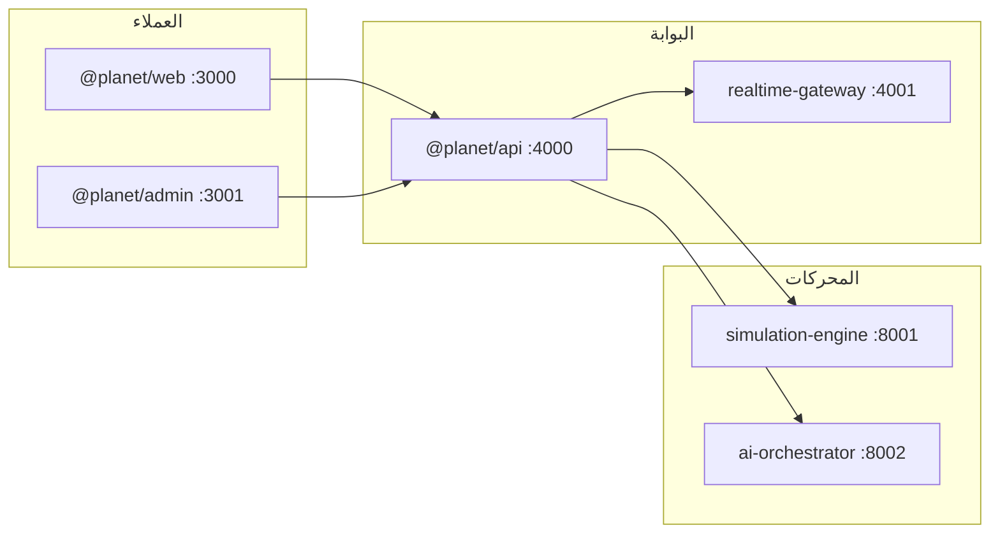

# كوكب يولد أمامك

> **الشعار:** عالم حي يتشكّل أمام عينيك — كل مساهمة تترك أثرًا سببيًا في التاريخ.

منصة محاكاة كوكبية تعاونية. يحقن المستخدمون الحياة والثقافات والاختراعات والأحداث في محرك عالم **حتمي**. الذكاء الاصطناعي يساعد في المراجعة والتوازن والسرد — **دون اختلاق حقائق** خارج حالة المحاكاة.

English: [README.md](./README.md)

---

## الرؤية

شاهد كوكبًا يتقدّم عبر الزمن: بيئات تتشكّل، أنواع تظهر وتنقرض، حضارات تتاجر وتحارب، وكل عنصر يضيفه المستخدم يدخل في **رسم بياني سببي** يمكن تدقيقه. الواجهة العامة للمستكشفين والمبدعين؛ لوحة الإدارة (المنفذ 3001) منفصلة **بدون أي رابط من الويب العام**.

---

## المعمارية



التفاصيل: [docs/architecture.md](./docs/architecture.md)

---

## هيكل المستودع

- `apps/web` — تطبيق الجمهور (:3000)
- `apps/admin` — لوحة العمليات (:3001)
- `packages/*` — أنواع مشتركة، نماذج محاكاة، تحقق، إعدادات، تحليلات
- `services/api` — واجهة REST + `/docs`
- `services/simulation-engine` — محرك التيك (Python)
- `services/ai-orchestrator` — خط أنابيب الذكاء الاصطناعي
- `docs/` — التوثيق التفصيلي

---

## البدء السريع

```bash
pnpm install
cp .env.example .env
pnpm db:migrate
pnpm db:seed

pnpm dev:api     # :4000
pnpm dev:sim     # :8001
pnpm dev:ai      # :8002
pnpm dev:web     # :3000
pnpm dev:admin   # :3001
```

---

## حسابات التجربة

| الحساب | البريد | كلمة المرور | ملاحظة |
|--------|--------|-------------|--------|
| **المدير الأعلى** | `admin@planet.local` | `Admin@Planet2026!` | موثّق **هنا فقط** — لا يُعرض في الواجهة العامة |
| مستكشف تجريبي | `explorer@planet.local` | `Explorer@123` | مساهم من البذرة |

لوحة الإدارة: http://localhost:3001/login

---

## مزوّدو الذكاء الاصطناعي / وضع الصندوق الرملي

الافتراضي: `AI_PROVIDER=mock` بدون مفاتيح. السرد ملتزم بالحقائق فقط.

| المزوّد | المتغير |
|---------|---------|
| mock | لا شيء |
| openai | `OPENAI_API_KEY` |
| anthropic | `ANTHROPIC_API_KEY` |
| gemini | `GEMINI_API_KEY` |

---

## محرك المحاكاة

تيكات حتمية: مناخ → بيئة (لوتكا–فولتيرا) → أسواق ومسارات ديijkstra → ذكاء حضارات → أحداث سببية ولقطات.

- [docs/simulation-engine.md](./docs/simulation-engine.md)
- [docs/algorithms.md](./docs/algorithms.md)

---

## واجهة البرمجة

http://localhost:4000/docs — و [docs/api.md](./docs/api.md)

---

## Docker

```bash
docker compose up --build
```

---

## الاختبارات والنشر

```bash
pnpm --filter @planet/simulation-models test
pnpm --filter @planet/api test
python3 -m pytest -q   # داخل كل خدمة بايثون
```

النشر والأمان: [docs/deployment.md](./docs/deployment.md) · [docs/security.md](./docs/security.md)

---

## مصفوفة اكتمال الميزات

| الميزة | الحالة |
|--------|--------|
| المصادقة و JWT | **مفعّل** |
| RBAC | **مفعّل** |
| الكواكب والتيك | **مفعّل** |
| المساهمات + تحليل AI (وهمي) | **مفعّل** |
| لوحة الإدارة | **مفعّل** |
| WebSocket للفروقات | **مفعّل** (اختياري) |
| قياس تكلفة AI للإنتاج | **غير مفعّل** (عنصر نائب) |
| إعدادات إدارة دائمة | **غير مفعّل** |
| رابط للإدارة من الويب العام | **مفقود عمدًا** |
