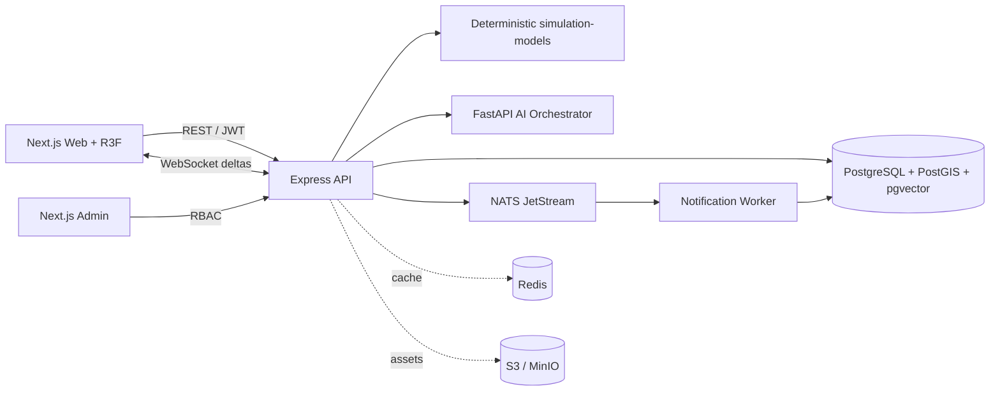

# كوكب يولد أمامك · A Planet Born Before You

**عالمك، قرارك، أثر لا ينتهي. · Your world. Your decision. Endless impact.**

منصة عالم حي ثلاثي الأبعاد مبنية حول محاكاة حتمية قابلة لإعادة التشغيل. يضيف المستخدم عنصرًا واحدًا، فيحوّله محلل منظم إلى خصائص رقمية، يوازنها، ثم يمررها إلى محرك سببي مستقل. نموذج اللغة لا يقرر نتيجة العالم؛ وظيفته فهم المدخل وصياغة أحداث أنتجتها المحاكاة فقط.

This repository contains a deployable vertical slice of a deterministic living-world platform. A contribution is structured and balanced before it reaches a causal simulation engine. Language models cannot mutate world state and may narrate only event IDs produced by the simulator.

## ما يعمل فعليًا · Working capabilities

- كوكب WebGL إجرائي من Seed ثابت، بخامة GLSL للتضاريس والمحيطات والثلوج وأضواء الليل، وسحب وغلاف جوي مستقلين.
- تدوير وتقريب ولمس، اختيار مناطق فعلية، عشر طبقات عرض، إعدادات جودة، وسجل أحداث وخط زمني.
- 240 منطقة مترابطة من الارتفاع والرطوبة والحرارة والخصوبة؛ 12 حضارة، 40 مدينة، 120 موردًا، 800 نبات، 300 مخلوق، و50 تقنية في بيانات PostgreSQL التجريبية.
- محرك Ticks حتمي، PRNG مزروع، Event Sourcing، Snapshots، Replay، Causal Links، وحدود سعة بيئية.
- نموذج مبسط للمناخ والسكان وضغط الموارد واحتمال الحرب؛ لا يبدأ حدث بلا إشارة سببية محفوظة.
- تدفق إضافة فعلي: فئة ← فكرة ← Structured Output ← موازنة ← منطقة ملائمة ← 64 مسار Monte Carlo ← حفظ ← Delta لحظي.
- REST/OpenAPI عند `/docs` وWebSocket عند `/ws`، مع JWT قصير العمر وتدوير Refresh Token وRBAC.
- PostgreSQL + PostGIS + pgvector، NATS JetStream، Redis، MinIO، وعامل إشعارات.
- لوحة إدارة منفصلة للتحكم بالدورات والإيقاف والـRollback.
- موفرو AI قابلون للتبديل: OpenAI-compatible، Anthropic-compatible، Gemini-compatible، local، وSandbox معلن.
- العربية RTL والإنجليزية LTR، واجهة متجاوبة، وPWA manifest.

المكوّنات الأعمق المطلوبة في الرؤية — اقتصاد سوق كامل، GOAP متعدد الوكلاء، حدود سياسية شبكية، ومحاكاة سوائل/غلاف جوي عالية الدقة — لها حدود توسعة في النموذج وقاعدة البيانات، لكنها **ليست معروضة كميزات مكتملة** في هذه النسخة.

## تشغيل سريع · Quick start

### وضع التطوير الخفيف

يتطلب Node.js 22 وpnpm 10. لا يحتاج هذا الوضع إلى قاعدة بيانات؛ يستخدم Memory Event Store وAI Sandbox ويعرض الشارتين بوضوح.

```bash
cp .env.example .env
pnpm install
pnpm dev
```

- الويب: <http://localhost:3000>
- الإدارة: <http://localhost:3001>
- API وSwagger: <http://localhost:4000/docs>

### المكدس الكامل

```bash
docker compose up --build
```

يشغّل PostgreSQL المزوّد بـPostGIS وpgvector، وينفذ migration وseed، ثم يشغّل NATS وRedis وMinIO وAI وAPI والعامل والواجهتين.

## حسابات Sandbox

هذه البيانات محلية فقط وموجودة هنا عمدًا، ولا تُنشأ في `APP_ENV=production`:

| الاستخدام | البريد | كلمة المرور | الدور |
|---|---|---|---|
| الويب والإدارة | `explorer@azura.world` | `Azura!2347` | `super_admin` |

`AI_PROVIDER=sandbox` يعيد Structured Output حتميًا وموسومًا `sandbox`. يرفض AI Orchestrator البدء بهذا المزود عندما تكون `APP_ENV=production`. كما يرفض API استخدام Memory Store في `NODE_ENV=production`.

## المعمارية · Architecture



| المسار | المسؤولية |
|---|---|
| `apps/web` | واجهة العالم والكوكب وخط الإضافة والزمن |
| `apps/admin` | إدارة المحاكاة المحمية |
| `services/api` | REST وWebSocket والمصادقة ومستودع الأحداث |
| `services/ai-orchestrator` | Structured Output وموازنة وسرد مقيد بالأحداث |
| `services/notification-worker` | تحويل أحداث NATS المرتبطة بالمساهمات إلى إشعارات |
| `packages/shared-types` | عقود Zod/TypeScript المشتركة |
| `packages/simulation-models` | المولد الحتمي ومحرك Tick وReplay وMonte Carlo |
| `services/api/migrations` | مخطط PostgreSQL الفعلي |
| `docker` | صور Node وPython وPostgreSQL |

شفرة Expo القديمة المستوردة مع المستودع باقية خارج `pnpm-workspace.yaml` لأغراض التتبع فقط، ولا تدخل في أي build أو runtime للمنصة الجديدة.

## دورة البيانات

1. يفحص API النص بقواعد الإساءة وPrompt Injection.
2. يعيد AI Adapter كائنًا مطابقًا لـ`AnalyzedContribution` فقط.
3. تفرض طبقة الموازنة حدود التكاثر والطاقة والامتصاص.
4. تتحقق Zod/Pydantic من كل حقل ومن ملاءمة المنطقة الحيوية.
5. تشغّل Monte Carlo مسارات مزروعة وتعرض الاحتمال وعدم اليقين.
6. يتحقق الحفظ من `expectedPlanetVersion` لمنع الكتابة فوق عالم تغير.
7. ينشئ المحرك `CONTRIBUTION_ADDED` ثم أحداثًا مشتقة بروابط سببية.
8. تحفظ المعاملة الحالة والأحداث والروابط والـSnapshot، ثم ترسل Delta عبر WebSocket وNATS.

## أوامر الجودة

```bash
pnpm check
pnpm test
pnpm build
pnpm --filter @living-planet/simulation-models test
docker compose config --quiet
```

تتحقق اختبارات المحاكاة من ثبات Seed، والتطابق الكامل عند Replay، ووجود سبب لكل حدث، وعدم تجاوز السكان للسعة البيئية.

## قاعدة البيانات

ينشئ migration نماذج فعلية لـUser, Profile, Role, Planet, PlanetRegion, Biome, ClimateCell, Species, Plant, Resource, Civilization, City, Technology, Culture, Language, TradeRoute, Alliance, War, Disease, Migration, UserContribution, SimulationTick, WorldEvent, CausalLink, TimelineSnapshot, AIRequest, ModerationResult, Notification, AuditLog وWorldMemory.

```bash
pnpm db:migrate
pnpm db:seed
```

تفاصيل أكبر في:

- [`docs/architecture.md`](docs/architecture.md)
- [`docs/simulation.md`](docs/simulation.md)
- [`docs/database.md`](docs/database.md)
- [`docs/api-and-realtime.md`](docs/api-and-realtime.md)
- [`docs/deployment.md`](docs/deployment.md)

## Production notes

Production requires PostgreSQL, NATS, a 32+ character `JWT_SECRET`, `INTERNAL_SERVICE_TOKEN`, explicit CORS origins, and a configured non-sandbox AI provider. Put TLS and a WAF/reverse proxy in front of the three public services. Secrets must come from the deployment secret manager, never `.env` committed to source control.

The simulation remains deterministic for a seed, tick, and ordered event history. External AI output is validated but never passed to executable code, SQL, shell commands, or internal system prompts.
