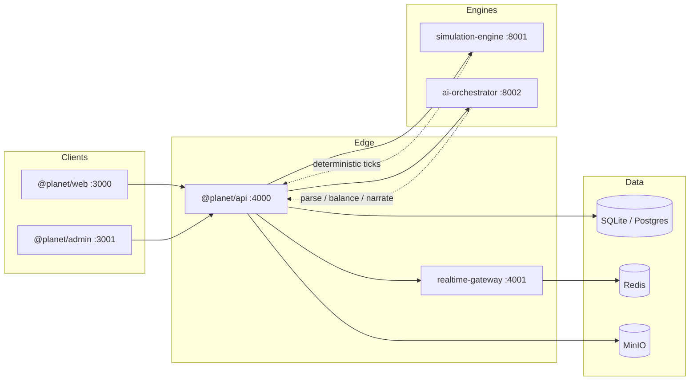

# كوكب يولد أمامك — Planet Born Before You

> **Slogan:** A living world unfolds before your eyes — every contribution leaves a causal scar on history.

**كوكب يولد أمامك** is a collaborative planetary simulation platform. Users inject life, cultures, inventions, and events into a deterministic world engine. AI assists with moderation, balance, and narration — never inventing facts outside the simulation state.

Arabic docs: [README.ar.md](./README.ar.md)

---

## Vision

Watch a planet age in accelerated time: biomes form, species rise and fall, civilizations trade and wage war, and every user element becomes part of a causal graph you can audit. The public web is for explorers and creators; the admin console (port 3001) is a separate ops surface with **no link from the public web**.

---

## Architecture



**Separation of concerns**

| Layer | Responsibility |
|-------|----------------|
| Simulation | Authoritative world state, ticks, snapshots, causality |
| AI | Parse contributions, balance traits, narrate from facts only |
| UI (web/admin) | Presentation + auth; never invents sim truth |

See [docs/architecture.md](./docs/architecture.md).

---

## Monorepo structure

```
apps/
  web/                 # Public Next.js app (:3000)
  admin/               # Ops console @planet/admin (:3001)
packages/
  shared-types/        # Domain TypeScript types
  simulation-models/   # TS tick engine, noise, ecology, civ AI
  validation/          # Zod / shared schemas
  config/              # Ports, theme CSS vars, presets
  analytics/           # @planet/analytics track() helper
  ui/                  # Shared UI primitives (optional)
services/
  api/                 # Fastify REST + Swagger /docs
  realtime-gateway/    # WebSocket delta fan-out
  simulation-engine/   # Python FastAPI sim
  ai-orchestrator/     # Python AI pipeline
  world-generator/     # Terrain helpers
  notification-worker/ # Notification poller
docs/                  # Architecture, algorithms, API, security…
infra/docker/          # Dockerfiles
```

---

## Quick start

Prerequisites: **Node 20+**, **pnpm 9**, **Python 3.11+**.

```bash
pnpm install
cp .env.example .env

pnpm db:migrate
pnpm db:seed

# Terminals (or use docker compose)
pnpm dev:api          # :4000  — OpenAPI at http://localhost:4000/docs
pnpm dev:sim          # :8001
pnpm dev:ai           # :8002
pnpm dev:web          # :3000
pnpm dev:admin        # :3001
```

Root `pnpm dev` runs api + web + realtime + admin in parallel.

---

## Sandbox accounts

| Account | Email | Password | Notes |
|---------|-------|----------|-------|
| **Super Admin** | `admin@planet.local` | `Admin@Planet2026!` | Documented **here only** — never expose in the public UI |
| Demo explorer | `explorer@planet.local` | `Explorer@123` | Seeded contributor |

Admin console: http://localhost:3001/login

---

## AI providers / sandbox mode

Default: **`AI_PROVIDER=mock`** (sandbox). No API keys required. Narratives are fact-strict; the mock provider labels itself as sandbox.

| Provider | Env |
|----------|-----|
| mock (default) | none |
| openai | `OPENAI_API_KEY` |
| anthropic | `ANTHROPIC_API_KEY` |
| gemini | `GEMINI_API_KEY` |

See [docs/ai-integration.md](./docs/ai-integration.md).

---

## Simulation engine overview

Deterministic ticks over seed + injection log:

1. Climate diffusion  
2. Ecology (Lotka–Volterra)  
3. Markets + Dijkstra trade  
4. Civilization utility AI / wars  
5. Append events to causal graph + optional snapshot  

Details: [docs/simulation-engine.md](./docs/simulation-engine.md) · Algorithms: [docs/algorithms.md](./docs/algorithms.md)

---

## API docs

Interactive OpenAPI: **http://localhost:4000/docs**  
Reference: [docs/api.md](./docs/api.md)

WebSocket deltas: `planet.delta`, `planet.rollback` via realtime-gateway.

---

## Docker Compose

```bash
docker compose up --build
```

Services: postgres, redis, minio, api, sim, ai, realtime, web, admin, notification-worker.

See [docs/deployment.md](./docs/deployment.md).

---

## Testing

```bash
pnpm --filter @planet/simulation-models test
pnpm --filter @planet/api test
cd services/simulation-engine && python3 -m pytest -q
cd services/ai-orchestrator && python3 -m pytest -q
```

CI: `.github/workflows/ci.yml` — install, build packages, unit tests, pytest both Python services, build web + admin.

---

## Deployment

1. Set secrets (`JWT_SECRET`, `JWT_REFRESH_SECRET`, DB, S3).  
2. Prefer Postgres + Redis in production (`DATABASE_URL`).  
3. Run migrations + seed (or migrate-only).  
4. Disable mock AI if using real providers.  
5. Put admin behind VPN / IP allowlist — **no public nav link**.  

Checklist: [docs/deployment.md](./docs/deployment.md) · Security: [docs/security.md](./docs/security.md)

---

## Feature completeness matrix

| Feature | Status |
|---------|--------|
| Auth (register / login / JWT refresh) | **Live** |
| RBAC roles (visitor → super_admin) | **Live** |
| Planet list / detail / tick | **Live** |
| Contributions + AI analyze (mock) | **Live** |
| Local / remote simulation tick | **Live** |
| Causal events + timeline snapshots | **Live** (snapshots depend on seed/engine) |
| Realtime WebSocket deltas | **Live** (optional if gateway up) |
| Admin console (stats, users, sim, mod, AI, audit) | **Live** |
| Monte Carlo forecast API | **Live** in sim engine; web UI may be partial |
| Full Postgres dual-driver in API | **Partial** — local default SQLite; compose ships PostGIS schema |
| Object storage (MinIO) uploads | **Not enabled** end-to-end in API routes |
| Production AI cost metering | **Placeholder** (admin shows $0 + note) |
| Durable admin system settings | **Not enabled** (in-process map only) |
| Public link to admin from web | **Intentionally absent** |

---

## License

Private / project license — see repository owners.
