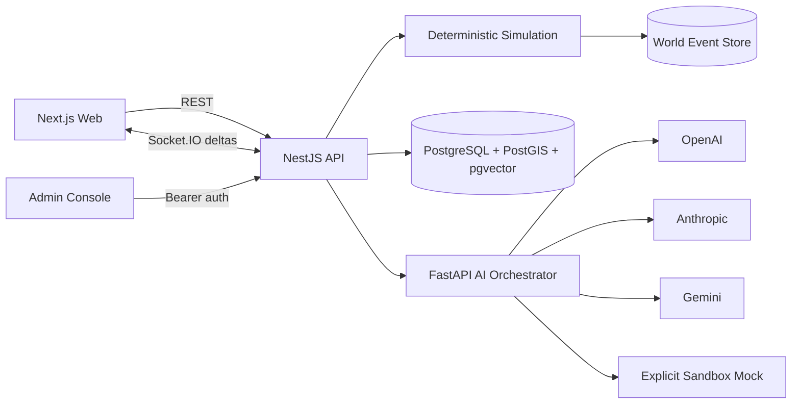

# كوكب يولد أمامك | A Planet Born Before You

**عالمك، قرارك، أثر لا ينتهي.**  
**Your world, your decision, an endless impact.**

منصة ويب لمحاكاة عالم إجرائي حي. يولّد الخادم الكوكب من Seed ثابت، ويحفظ
التغيرات كأحداث سببية قابلة لإعادة التشغيل. الذكاء الاصطناعي يفهم إضافة
المستخدم ويصوغها فقط؛ محرك المحاكاة هو الذي يقرر تغير الحالة.

A living procedural-world platform. The server regenerates the planet from a
stable seed and stores state transitions as replayable causal events. AI
normalizes and explains user input; simulation algorithms own world-state
decisions.

> هذه النسخة هي **المقطع التشغيلي الأول** من المعمارية النهائية، وليست ادعاءً
> باكتمال كل نظام الاقتصاد والحروب والأمراض والمراقبة في المواصفات الموسعة.
> العناصر غير المنفذة في لوحة الإدارة مميزة بوضوح بأنها غير مفعلة.

## ما يعمل الآن | What works now

- توليد 512 خلية كوكبية حتميًا باستخدام fractal/ridge noise وخط العرض والارتفاع
  والرطوبة وظل المطر، ثم تصنيف 12 إقليمًا حيويًا.
- بيانات Seed فعلية: 12 حضارة، 40 مدينة، 120 موردًا، 300 نوع مخلوق، 800 نبات،
  و50 تقنية.
- محرك Ticks حتمي، Event Sourcing، Replay، Snapshots مع integrity hash، وروابط
  سببية بين الأحداث.
- PostgreSQL 17 + PostGIS + pgvector، مع migration قابلة للتشغيل ومخطط Drizzle
  يحوي 31 جدولًا.
- NestJS REST API موثق عبر Swagger، مصادقة بريد/كلمة مرور، Refresh Token
  Rotation، وتحديثات Socket.IO delta.
- FastAPI AI orchestrator يدعم adapters لـ OpenAI وAnthropic وGemini وMock؛
  يفرض Structured Output ويكشف Prompt Injection ويوازن الخصائص الخارقة.
- واجهة Next.js عربية RTL تعرض كوكب React Three Fiber مرتبطًا ببيانات المناطق،
  طبقات الحرارة والتلوث والحضارات، سجل أحداث، خطًا زمنيًا، واختيار المناطق.
- مسار فعلي: فكرة ← تحليل منظم ← معاينة المخاطر ← اختيار منطقة ← حفظ المساهمة
  ← تشغيل 25 Tick ← تحديث العالم والأحداث.
- لوحة إدارة مستقلة على المنفذ `3001` لا يظهر رابطها في واجهة المستخدم.

## التشغيل السريع | Quick start

المتطلبات: Node.js 22+، pnpm 9، Python 3.12+، وDocker عند استخدام التخزين
الدائم.

```bash
cp .env.example .env
pnpm install

# البنية التحتية وAI sandbox
docker compose up -d postgres redis nats minio ai-orchestrator
pnpm db:migrate
pnpm db:seed

# في نوافذ منفصلة
pnpm dev:api
pnpm dev:web
pnpm --filter @planet/admin dev
```

- واجهة العالم: `http://localhost:3000`
- لوحة الإدارة: `http://localhost:3001`
- REST API: `http://localhost:4000/api`
- Swagger: `http://localhost:4000/docs`
- AI OpenAPI: `http://localhost:8001/docs`

لتشغيل وضع Sandbox بلا PostgreSQL، احذف `DATABASE_URL` من البيئة وشغّل API.
تظهر الواجهة عندئذ عبارة `memory-sandbox`، ويرفض الخادم هذا الوضع إذا كانت
`APP_ENV=production`.

### حساب Super Admin التجريبي

يُنشأ فقط عبر `pnpm db:seed` أو ذاكرة Sandbox المحلية:

```text
Email: admin@planet.local
Password: PlanetSandbox!2026
```

لا تستخدم هذه البيانات أو `JWT_SECRET` الافتراضي في أي بيئة منشورة.

## بنية المستودع | Repository structure

```text
apps/
  web/                 Next.js + React Three Fiber world dashboard
  admin/               Separate authenticated operations console
services/
  api/                 NestJS REST, auth, persistence, Socket.IO
  ai-orchestrator/     FastAPI structured AI provider boundary
packages/
  shared-types/        Zod contracts shared across boundaries
  simulation-models/   World generation, PRNG, ticks, replay, snapshots
  database/            PostgreSQL schema, migration, seed, connection
```

المسارات القديمة في جذر المستودع تخص المشروع الذي سبق استيراد هذه المنصة،
وليست ضمن `pnpm-workspace.yaml` أو مسار البناء الجديد.

## حدود الأنظمة | System boundaries



1. لا يكتب نموذج اللغة في حالة العالم.
2. `ContributionAnalysisSchema` يتحقق من JSON قبل دخوله المحرك.
3. `addContribution` يحسب أثرًا أوليًا محدودًا ويربطه بسبب وصاحب مساهمة.
4. كل Tick مشتق من `world.seed + tick` ويخزن
   `SIMULATION_TICK_COMPLETED`، لذلك يعيد Replay الزمن والحالة نفسيهما.
5. السرد الحتمي الحالي لا يذكر إلا أحداثًا واردة في الطلب ويشير إلى معرف كل
   حدث. إضافة سرد LLM تتطلب اجتياز فحص الاستشهاد نفسه.

تفاصيل إضافية: [المعمارية والمحاكاة](docs/planet-architecture.md) و
[عقد API وWebSocket](docs/planet-api.md).

## قاعدة البيانات | Database

يشمل المخطط: User, Profile, Role, Planet, PlanetRegion, Biome, ClimateCell,
Species, Plant, Resource, Civilization, City, Technology, Culture, Language,
TradeRoute, Alliance, War, Disease, Migration, UserContribution,
SimulationTick, WorldEvent, CausalLink, TimelineSnapshot, AIRequest,
ModerationResult, Notification, AuditLog، وWorldMemory vector.

```bash
pnpm db:migrate
pnpm db:seed
```

الـmigration يفعّل PostGIS وpgvector قبل إنشاء الجداول. يستخدم Docker image
مبنيًا فوق PostGIS ويضيف حزمة pgvector؛ لا يعتمد على وجود extension غير مثبت.

## مزودو الذكاء الاصطناعي | AI providers

اضبط `AI_PROVIDER` على `mock` أو `openai` أو `anthropic` أو `gemini`، ثم أضف
المفتاح المقابل. `mock` حتمي ومخصص للاختبار وتعيد استجاباته
`"sandbox": true`. بدء الخدمة بـ`APP_ENV=production` و`AI_PROVIDER=mock` يفشل
مباشرة.

```bash
cd services/ai-orchestrator
python3 -m pip install -e '.[dev]'
APP_ENV=sandbox AI_PROVIDER=mock uvicorn app.main:app --port 8001
```

## الجودة | Quality

```bash
pnpm build
pnpm typecheck
pnpm test
cd services/ai-orchestrator && python3 -m pytest
```

تغطي اختبارات المحرك حاليًا:

- تطابق العالم والتاريخ لنفس Seed.
- اختلاف العالم عند اختلاف Seed.
- تطابق `stateHash` بعد Event Replay.
- فحص سلامة Snapshot قبل Rollback.
- منع الأحداث بلا سبب.
- منع إنشاء حضارة بلا سكان أو في المحيط/الجليد.

وتغطي اختبارات AI: Structured Output، ووسم Mock كـSandbox، ورفض Prompt
Injection، وتحويل الصفات غير المحدودة إلى نسخة متوازنة.

## حالة مراحل المنتج | Roadmap status

| المجال | الحالة |
|---|---|
| الأساس، العقود، المولد، Ticks، Event Sourcing | عامل |
| REST، Swagger، WebSocket delta، المصادقة | عامل |
| واجهة الكوكب والطبقات ومسار الإضافة | عامل |
| PostgreSQL migration وبيانات Seed | عامل |
| AI adapters والتحقق والتوازن | عامل؛ يتطلب مفتاحًا للمزود الحقيقي |
| Monte Carlo، اقتصاد، تجارة، حرب، أمراض عميقة | المرحلة التالية |
| Rollback إداري مرئي، OpenTelemetry، لوحات تكلفة | غير مفعّل بعد |
| LOD وخامات KTX2 وOffscreenCanvas الإنتاجية | غير مفعّل بعد |

## Production gates

- استخدم PostgreSQL وRedis وNATS وS3 مدارة، ولا تسمح
  بـ`memory-sandbox`.
- غيّر أسرار JWT وMinIO واحفظها في Secret Manager.
- فعّل TLS وقيّد `WEB_ORIGIN` وطبّق RBAC أدق على أوامر المحاكاة.
- شغّل migrations ونسخًا احتياطية واختبار استعادة قبل النشر.
- اختر مزود AI حقيقيًا وراقب التكلفة؛ لا تحول Mock إلى نتيجة إنتاج.
- أكمل فحص الملفات وCSRF/Origin enforcement واختبارات الحمل قبل فتح الرفع أو
  التسجيل العام.
