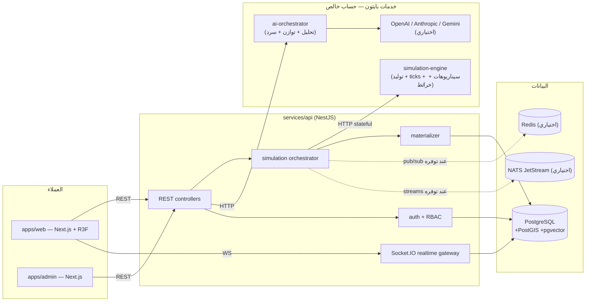
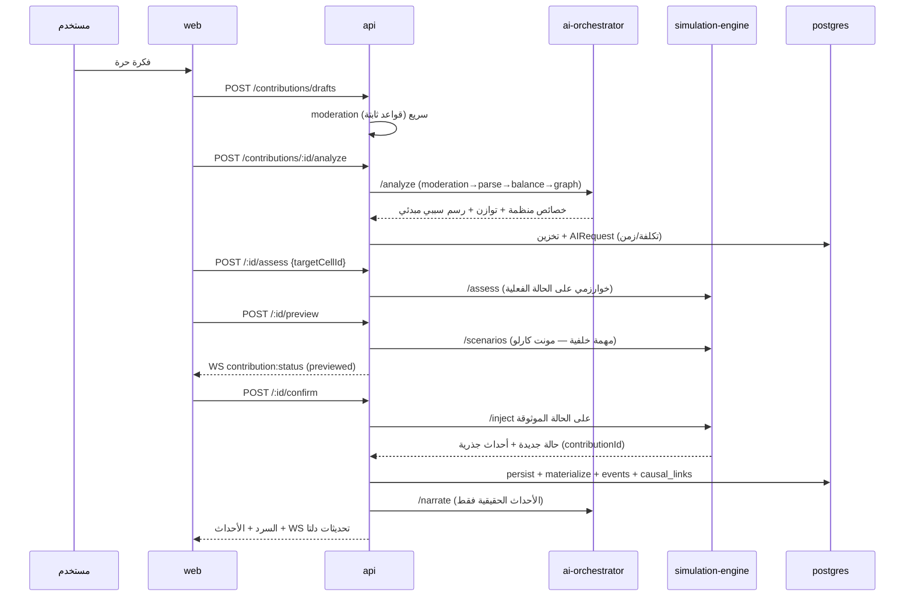

# المعمارية / Architecture

## نظرة عامة

## مبدأ التصميم الأساسي: فصل الحساب عن التنسيق

محرك المحاكاة خدمة **حساب خالص (pure compute)**: تستقبل حالة كاملة (JSON) وتعيد حالة جديدة + أحداثًا سببية. لا تلمس قاعدة البيانات ولا تعرف المستخدمين. هذا يجعل الحتمية قابلة للاختبار بالكامل (`same seed ⇒ same history`)، ويسمح بأي جدولة (real-time ticks، تقديم دُفعات، سيناريوهات متفرعة) بنفس الكود.

خدمة API هي **منسّق العالم**: تملك الحالة الموثوقة في `planets.current_state`، وتستدعي المحرك، وتُسقط النتائج على:

- **نموذج قراءة علائقي** (`planet_regions`, `civilizations`, `species`, ...) عبر `materializer.ts` بعد كل تقديم — استعلامات الواجهة لا تُحلّل JSON العملاق.
- **سجل الأحداث** (`world_events`) + **روابط السببية** (`causal_links`) — يدعم البحث والسلاسل السببية عبر CTE تعاودية.
- **Snapshots** كل 25 tick أو عند أحداث أهمية 5 → تدعم Rollback والمقارنة بين الحقب.
- **طبقات الخرائط** (PNG مولّدة من الحالة نفسها) تُخزَّن في `planet_map_layers` وتُعرض كخامات على الكرة.

## تدفق إضافة عنصر (الحلقة المركزية)

## القرارات الهندسية ولماذا

1. **Kysely + SQL migrations يدوية** بدل ORM ثقيل: شفافية كاملة مع PostGIS/pgvector، لا تنزيل محركات، أداء متوقع.
2. **JWT وصول قصير (15د) + Refresh مُدوَّر** مع كشف إعادة الاستخدام وإلغاء العائلة — انظر `docs/SECURITY.md`.
3. **الناقل (Bus)** مجرد طبقة تجريد: داخلي في العملية للتطوير الأحادي؛ Redis/NATS جاهزان في Compose للتوسع الأفقي (الواجهة نفسها عبر WebSocket لا تتأثر).
4. **وحدة الخرائط داخل المحرك**: الخامات مشتقة من نفس الحالة الحتمية ⇒ لا فصل بين البيانات والمؤثرات البصرية (قاعدة 9 من المواصفة).
5. **Notification worker و realtime gateway مدموجان في API حاليًا** (خدمات مستقلة اختيارية عند الحاجة للتوسع — القرار موثق هنا صراحة بدل إنشاء مجلدات فارغة). عبء الإشعارات والبث صغير نسبة لعبء المحاكاة في هذه المرحلة.

## حدود مقصودة (v1)

| المجال | الوضع | ملاحظة |
|---|---|---|
| NATS JetStream | مُعد في Compose | الواجهة البرمجية في API تفضله عند `NATS_URL`، وإلا Redis/داخلي |
| MinIO/S3 | مُعد | لا تخزين ملفات مستخدمين بعد (لا رفع صور في v1) |
| OTP | غير مفعّل | مخطط — بنية `users` جاهزة |
| WebGL Workers | جزئي | توليد الخامات البديلة يعمل في Worker؛ التصيير الرئيسي على الخيط الرئيسي مع LOD |

## English summary

The simulation engine is a **pure compute** FastAPI service (state in → state + causal events out). The NestJS API owns authoritative state, persists engine results into relational read models, event logs, causal links, snapshots and pre-rendered map layer textures, then pushes **delta** updates over Socket.IO. The AI orchestrator (provider-pluggable; mock sandbox by default) only parses ideas, enforces balance, builds causal priors, and narrates **validated** outcomes. See SIMULATION.md for the tick model and AI.md for provider behavior.
