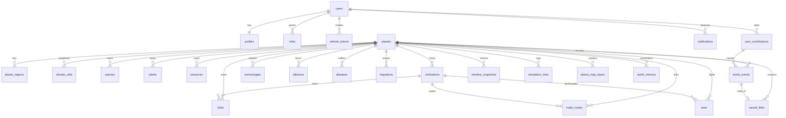

# قاعدة البيانات / Database

PostgreSQL 16 + PostGIS + pgvector. الترحيلات في `services/api/src/db/migrations/*.sql` تُطبَّق بالترتيب عبر `runMigrations` (معاملات لكل ملف + `schema_migrations`).

## مخطط الكيانات

## الكيانات (30)

| الجدول | الغرض | ملاحظات |
|---|---|---|
| users / profiles / roles | الهوية والأدوار | role الأساسي + منح إضافية؛ achievements في profile |
| refresh_tokens | تدوير الجلسات | `family_id` + كشف إعادة الاستخدام (revoke family) |
| planets | الحالة الموثوقة | `current_state` JSONB كامل + `tick`, `status`, `state_hash` |
| planet_regions | نموذج قراءة للخلايا | `geom GEOGRAPHY(Point)` جاهز لاستعلامات PostGIS |
| climate_cells | مناخ لكل snapshot | (planet, cell, tick) |
| biomes | كتالوج المناطق الحيوية | لوحة ألوان + سعة نباتية |
| species / plants | الكائنات والنباتات | traits JSONB + contribution_id + extinct |
| resources | تعريفات الموارد | قيمة/تجدد/أثر بيئي |
| civilizations / cities | الحضارات والمدن | personality/relationships/memory JSONB |
| technologies | الشجرة التقنية | discovered_by/tick + contribution |
| cultures / languages | الثقافة واللغة | لكل حضارة |
| trade_routes / alliances / wars | الاقتصاد والدبلوماسية والصراع | path/fronts/causes JSONB |
| diseases / migrations | الوباء والهجرات | |
| user_contributions | معالج الإضافة | structured/balance/graph/assessment/preview_report + status |
| simulation_ticks | سجل التقدم | مدة التنفيذ + hash لكل tick |
| world_events | سجل الأحداث | فهارس tick/type/contribution/importance |
| causal_links | حواف السببية | CTE تعاودية للسلاسل |
| timeline_snapshots | تجميد الحالة | state + summary للمقارنة والـ Rollback |
| world_memory | الذاكرة الدلالية | `embedding VECTOR(1536)` + فهرس ivfflat (pgvector) |
| ai_requests | محاسبة الذكاء | تكلفة/زمن/مزوّد/sandbox |
| moderation_results | الإشراف | allow/flag/block + مراجعة بشرية |
| notifications | الإشعارات | per-user + WS push |
| audit_logs | تدقيق | من فعل ماذا/متى/أين |
| jobs | مهام خلفية | معاينات مونت كارلو (SKIP LOCKED) |
| analytics_events | تحليلات | أحداث استخدام |
| planet_map_layers | خامات الخرائط | PNG لكل طبقة/tick |

## سياسة الحالة

- **الموثوق**: `planets.current_state` (خارج المحرك مباشرة).
- **مشتق**: كل جداول القراءة — يعاد بناؤها من الحالة بـ `materializeState` بعد كل تقديم/حقن/Rollback.
- **تاريخي غير قابل للحذف**: `world_events` و`causal_links` إلا عبر Rollback إداري موثّق (audit_logs).
- **النسخ الاحتياطي**: `pg_dump` دوري (انظر DEPLOYMENT.md) + إمكانية إعادة توليد أي حقبة من seed + الحقن المسجلة.

## English

Authoritative state lives in `planets.current_state`; relational read models (regions, civs, species…) are materialized after every advance; history is event-sourced (`world_events` + `causal_links` recursive chains) with snapshots for rollback/era-compare; pgvector-backed `world_memory` holds semantic history; PostGIS geography columns enable geospatial queries. Forward-only SQL migrations with a transactional runner.
