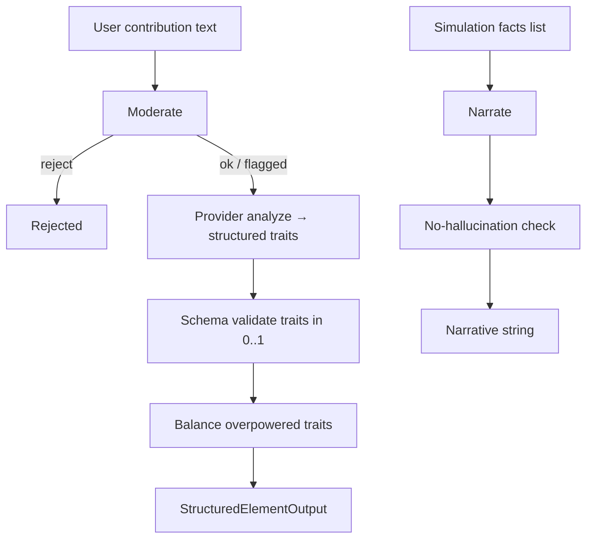

# AI integration

## Layers

| Layer | Purpose |
|-------|---------|
| **Parse** | Turn free text into category, name, traits, biomes, risks |
| **Balance** | Cap god-mode traits; suggest alternatives |
| **Narrate** | Compose story **only** from caller-supplied facts |
| **Moderate** | Ban harm patterns + prompt-injection (EN/AR) |

## Providers

Factory in `services/ai-orchestrator/app/providers/`:

| `AI_PROVIDER` | Behavior |
|---------------|----------|
| `mock` / unset | Deterministic sandbox; hashes + keyword rules |
| `openai` / `anthropic` / `gemini` | Live adapters; factory falls back to mock if key missing |

Sandbox health reports `sandbox: true`.

## No hallucination rule

Narratives must not invent tokens/entities absent from the fact list. Template narration is default; optional LLM output is rejected and replaced if it invents content. Successful responses keep `invented: false`.

## API surface (orchestrator)

- `POST /ai/analyze-element`
- `POST /ai/narrate`
- `POST /ai/moderate`
- `POST /ai/balance`
- `GET /health`

The Node API records rows in `ai_requests` for the admin cost/latency monitor (cost USD remains a **placeholder** until billing hooks land).

## Related

- Orchestrator README: `services/ai-orchestrator/README.md`
- Admin page: `/ai` in `@planet/admin`
