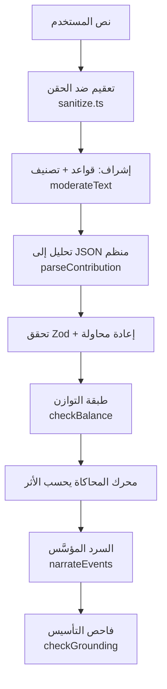

# ربط الذكاء الاصطناعي — AI Integration

## الطبقات

### 1. فهم الإضافات
الموجه النظامي يفرض مخططًا صارمًا (`category/name/description/traits/possibleBiomes/risks/benefits`) والناتج يمر بـ `parsedContributionSchema` (Zod). عند فشل التحقق تُعاد المحاولة مرة واحدة بموجه تصحيحي، ثم يفشل الطلب بصدق.

### 2. التوازن
خوارزمية لا نموذج: أسقف، ميزانية، تركيبات محظورة، ونسخة مقترحة معدّلة مع سجل تعديلات — انظر `packages/simulation/src/balance.ts`.

### 3. المحاكاة السببية
يحسبها المحرك كاملًا. الذكاء الاصطناعي لا يقرر أي نتيجة.

### 4. السرد المؤسَّس (Grounded Narration)
- المدخلات: أحداث المحاكاة + قائمة حقائق رقمية (`NarrationFact`).
- القاعدة: **يُمنع ذكر أي رقم غير موجود في الحقائق**. الفاحص يستخرج كل الأرقام (بما فيها الأرقام العربية-الهندية ٠١٢٣) من النص ويطابقها بسماحية تقريب.
- أي نموذج يهلوس → يُستبدل نصه فورًا بالقالب الحتمي المبني من الحقائق نفسها (`templateNarration`) ويُوسم `fellBackToTemplate`. اختبار آلي يثبت أن مزودًا هلاميًا لا يمرر أرقامًا مختلقة.

### 5. الوكلاء والشخصيات
قادة الحضارات قراراتهم من Utility AI مقيدة بحالة العالم (ذاكرة `memory` من أحداث حقيقية: هجمات سابقة، تحالفات) — ليست دردشة حرة.

## المزودون (Provider Adapters)

| المزود | الحالة |
|---|---|
| `mock` (Sandbox) | افتراضي بدون مفاتيح — محلل حتمي حقيقي يعتمد إشارات لغوية عربية/إنجليزية + استدلالات مجال (الشجرة العملاقة ⇒ استهلاك ماء مرتفع) |
| `openai` | GPT-4o-mini عبر `response_format: json_object` |
| `anthropic` | Claude Haiku عبر Messages API |
| `gemini` | Gemini Flash عبر `responseMimeType: application/json` |

الاختيار عبر `AI_PROVIDER` + المفاتيح؛ غياب المفتاح ⇒ Sandbox مع شارة صفراء دائمة في الواجهة ووسم `sandbox: true` في كل استجابة وسجل (`AIRequest.sandbox`). **لا تُعرض مخرجات Sandbox على أنها نموذج حقيقي أبدًا.**

## مكافحة الحقن (Prompt Injection)

- نص المستخدم بيانات داخل `<user_idea>…</user_idea>` فقط.
- تعقيم: حد أقصى 4000 حرف، إزالة محارف التحكم والاتجاه الخفي، تحييد عبارات التجاوز («ignore previous instructions»، «تجاهل التعليمات»…) بتحويلها إلى نص خامل مرئي.
- كشف إضافي: أنماط SQL/NoSQL/كتل كود → يُعلَّم للمراجعة (`flagged`) في طابور الإشراف.
- لا يتحول أي نص مستخدم إلى كود أو استعلام قاعدة بيانات أو موجه نظام — لا توجد قناة تنفيذ أصلًا.

## التكلفة والمراقبة

كل استدعاء يُسجَّل: مزود، نموذج، عملية، رموز داخل/خارج، تكلفة محسوبة من جدول أسعار، زمن استجابة، sandbox. لوحة الإدارة تعرض الإجمالي والتفصيل؛ تنبيه مقترح عند تجاوز ميزانية يومية (انظر roadmap).
