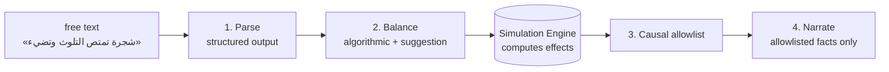

# AI Orchestration — طبقات الذكاء الاصطناعي

The platform uses AI in narrow, well-guarded layers. The simulation engine —
not the model — decides what happens.

## Layers

1. **Parse** — free text (ar/en) → `StructuredContribution` (category, name,
   traits 0..1, biomes, risks). Enforced via provider structured-output
   mechanisms (OpenAI `json_schema`, Anthropic forced tool use, Gemini
   `response_schema`) and **re-validated by pydantic/zod** after every call —
   invalid model output never reaches the engine.
2. **Balance** — algorithmic power budget (`packages/simulation-models`
   mirrored in `services/ai-orchestrator/app/balance.py`). Overpowered input
   gets an auto-nerfed suggestion, not a rejection.
3. **Simulate** — the engine computes primary/secondary/long-term effects;
   the causal graph records them.
4. **Narrate** — receives ONLY the allowlisted facts
   (`narrationAllowlist(journal, contributionId)`); instructed and tested to
   mention nothing else. The TS fallback narrator builds sentences directly
   from event records, making invention structurally impossible offline.

## Providers

| Provider | Selection | Structured output | Notes |
|---|---|---|---|
| `mock` | default / no keys | deterministic heuristic parser (ar/en) | the honest sandbox; labeled in every response |
| `openai` | `AI_PROVIDER=openai` + `OPENAI_API_KEY` | `response_format: json_schema` | models via `OPENAI_MODEL` |
| `anthropic` | `AI_PROVIDER=anthropic` + `ANTHROPIC_API_KEY` | forced `tool_use` | models via `ANTHROPIC_MODEL` |
| `gemini` | `AI_PROVIDER=gemini` + `GEMINI_API_KEY` | `response_schema` | models via `GEMINI_MODEL` |

All implement one protocol; failures raise `ProviderError` and the service
**degrades to the mock sandbox**, with the response still stating which
provider actually produced the result (`provider` + `sandbox` fields). No
result is ever presented as live-AI when it came from the sandbox.

## Cost & observability

Every parse call writes an `AIRequest` row (provider, kind, latency, cost
estimate, success). The admin console shows totals, failures and the current
mode (`/admin/ai-usage`).

## Anti-injection

User text passes the moderation gate first (prompt-injection patterns,
SQL/XSS/shell smuggling, spam). Remote prompts treat user text strictly as
data; there is no path from user text to system instructions, SQL, or code
execution.

## Agent AI (civilization leaders)

In-world decision making is Utility AI inside the engine (needs, risks,
geography, memory) — deliberately NOT free-form LLM chat, per the spec's
constraint that agent decisions be governed by world state. LLM-driven
leader personas are an explicit future phase and are marked not activated.
