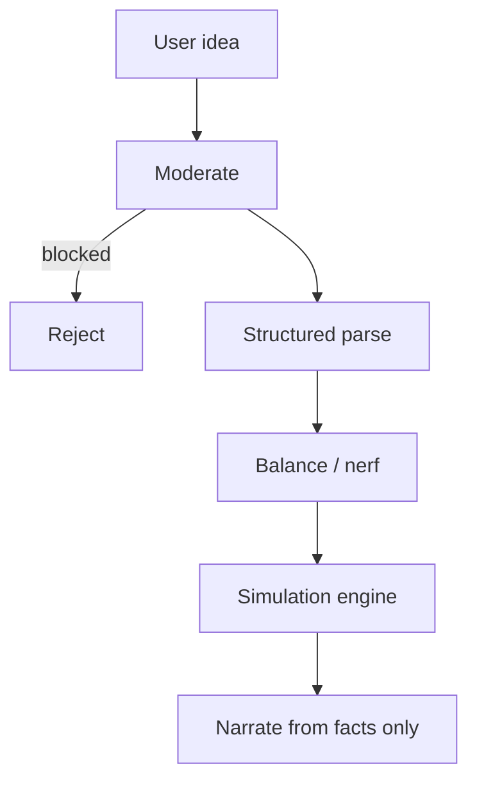

# AI Orchestration

AI **never replaces** the simulation engine.

## Providers

Adapters: `sandbox`, `openai`, `anthropic`, `gemini`.  
Missing keys → sandbox. Production must not present sandbox text as cloud-model output.

## Structured output

Parsed elements validate against shared schemas (`traits`, biomes, risks). Invalid payloads rejected before persistence.

## Balance

God-mode patterns (immortal, infinite energy, instant planetary destruction, absolute control) are nerfed into constrained traits with `wasBalanced=true` and notes.

## Narration contract

Narrator input = events + metrics only. Empty events → explicit “no simulation results yet”. Inventing wars/extinctions is a test failure (`test_narrate.py`).
