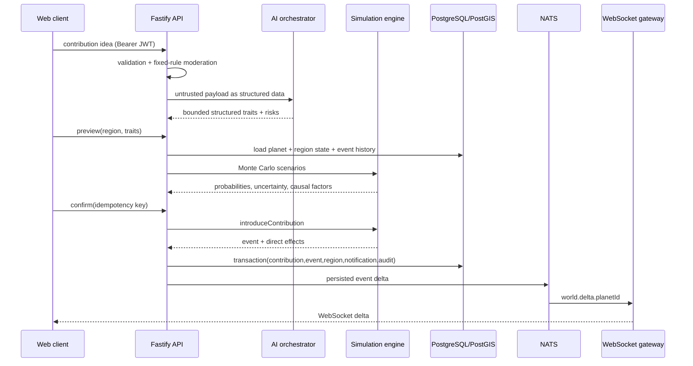
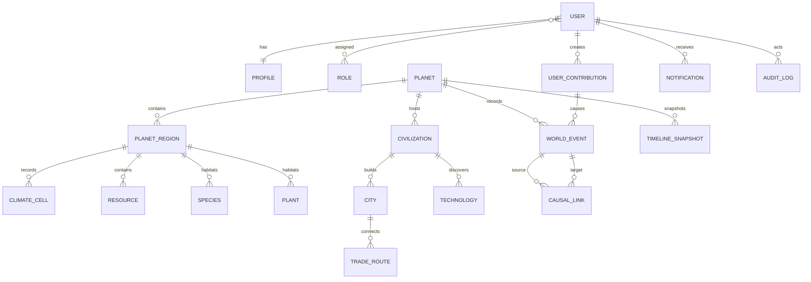

# المعمارية وقاعدة البيانات

## تدفق الكتابة

فشل AI لا ينتج fallback صامتًا. يعيد API الخطأ `AI_PROVIDER_UNAVAILABLE` مع `fallbackUsed:false`. وضع Mock لا يعمل إلا عند اختيار `AI_PROVIDER=mock`، ويظهر `sandbox:true`.

## حدود الملكية

- `world-generator`: الحالة الجغرافية الابتدائية فقط.
- `simulation-engine`: الزمن، الآثار، الاحتمالات، replay وsnapshot.
- `ai-orchestrator`: فهم اللغة والموازنة والسرد المقيد فقط.
- `api`: auth، المعاملات، idempotency، orchestration وOpenAPI.
- `realtime-gateway`: نقل deltas؛ لا يحسب حالة.
- `web`: عرض وتفاعل؛ لا يملك قانون محاكاة.

## مخطط البيانات المختصر

الجداول الفعلية الأخرى: cultures، languages، alliances، alliance_members، wars، diseases، migrations، simulation_ticks، ai_requests، moderation_results، refresh_tokens وworld_memory بـ`vector(1536)`.

## الاتساق

- `user_contributions.idempotency_key` فريد.
- تثبيت المساهمة يكتب المساهمة والحدث وحالة المنطقة والإشعار وaudit داخل transaction واحدة.
- tick يكتب الأحداث والمناطق و`simulation_ticks` داخل transaction واحدة.
- `world_events.cause` غير فارغ على مستوى قاعدة البيانات.
- السكان غير سالبين، وreducer يقيدهم بـcarrying capacity.
- PostGIS GiST index يخدم الاستعلامات الجغرافية.
- `world_memory` يملك HNSW cosine index للبحث الدلالي.

## قابلية التوسع

الحالة الدائمة في PostgreSQL، والدلتا العابرة عبر NATS. قبل تشغيل عدة كتّاب للمحاكاة يجب إضافة partition ownership أو distributed planet lock؛ الإصدار الحالي يفترض كاتب Tick واحدًا لكل كوكب. واجهات القراءة والـWebSocket قابلة للتوسع أفقيًا.
