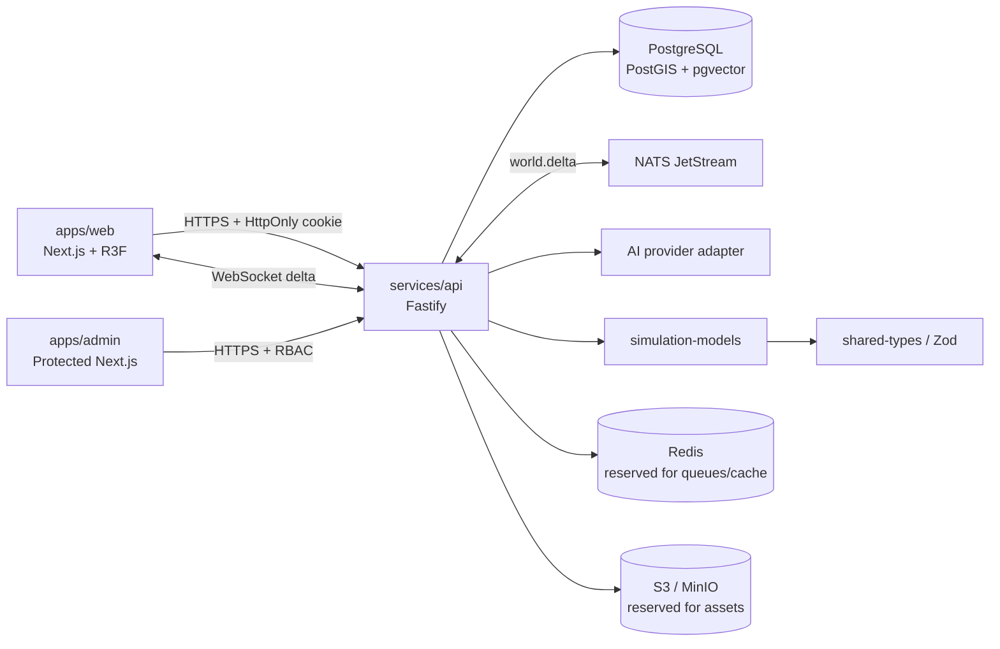
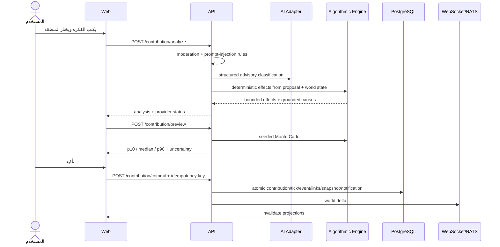

# معمارية منصة كوكب

## حدود النظام

`simulation-models` لا يستورد HTTP أو قاعدة بيانات أو React. الخادم وحده
ينسّق المصادقة والحفظ والمعاملات والبث. الواجهة تعرض Projections ولا تحتوي
على قواعد المحاكاة.

## مسار المساهمة

## Event sourcing

- `world_events` سجل append-oriented؛ الحذف المنطقي بعد rollback عبر
  `is_retracted`.
- `causal_links` يربط حدثًا سابقًا بحدث لاحق مع العلاقة والقوة.
- `timeline_snapshots` يحمل checksum وحالة Projection عند Tick معلوم.
- `simulation_ticks` يمنع تكرار رقم Tick لكل كوكب.
- محرك الحزمة يدعم `replay(events)` مستقلًا عن قاعدة البيانات، وتغطيه اختبارات
  حتمية.

## الأمان

- كلمات المرور Scrypt مع Salt، والجلسة JWT داخل Secure/HttpOnly cookie.
- فحص الجلسة المخزنة يسمح بإبطالها، وليس توقيع JWT وحده.
- RBAC مع تجاوز محدود لـ `super_admin`، ومفاتيح Sandbox مطلوبة لترقية الدور.
- CORS allow-list، Helmet/CSP، body limit، rate limiting، Zod وJSON Schema.
- نص المستخدم يعامل كبيانات غير موثوقة؛ لا ينفذ ككود أو SQL أو system prompt.
- وضع الإنتاج يرفض Mock AI وذاكرة Sandbox.

## حدود النسخة الحالية

Redis وMinIO موجودان في بيئة التشغيل لكن لا توجد Queue workers أو ملفات مستخدم
مفعلة بعد. PostGIS وpgvector مفعّلان في صورة التطوير، بينما تستخدم الجداول
الأولية latitude/longitude وJSONB لتبقى migration قابلة للعمل على PostgreSQL
مقيّد. الخدمات المنفصلة المذكورة في الرؤية (notification worker وworld
generator service) ممثلة حاليًا بحزم وحدود داخلية، وليست عمليات مستقلة بعد.
