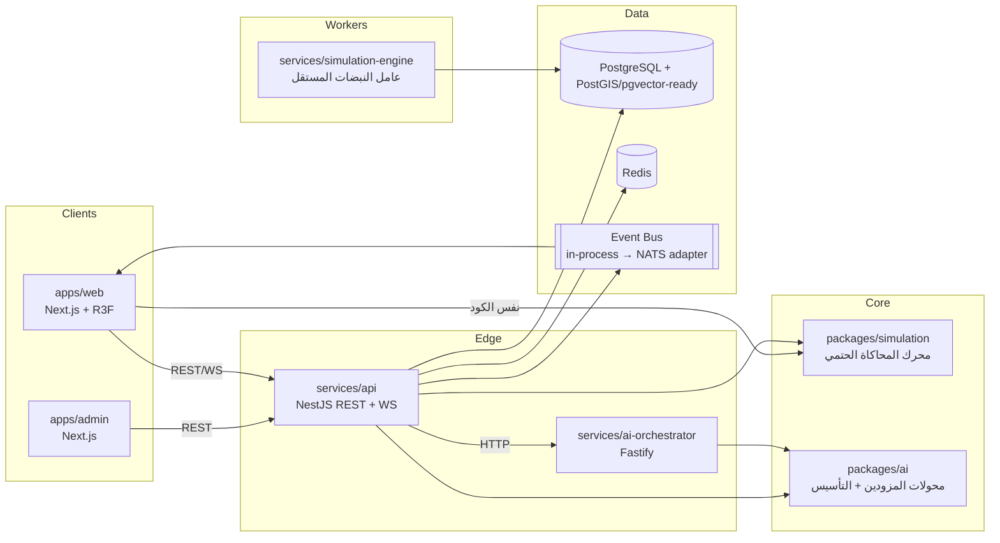

# المعمارية — Architecture

## المبدأ الحاكم

**الفصل الصارم بين الحقيقة والسرد.** محرك المحاكاة (`packages/simulation`) هو مصدر الحقيقة الوحيد — مكتبة خالصة بلا تبعيات نظام تشغيل، لذلك يعمل في الخادم (النبضات والاستمرارية) وفي عامل الويب بالمتصفح (توليد خامات الكوكب من نفس البذرة). الذكاء الاصطناعي طبقة ترجمة وتحليل حوله، لا بديل عنه.

## القرارات الهندسية (ADR)

### ADR-001: محرك المحاكاة بلغة TypeScript واحدة بدل Python
الموجز طلب Python/FastAPI للمحاكاة والذكاء الاصطناعي. اخترنا TypeScript الموحّد لسبب حاسم: **نفس كود توليد الكوكب والمحاكاة يجب أن يعمل في المتصفح** (عامل الويب يرسم التضاريس من البذرة وحدها) وفي الخادم (النبضات) وفي السيناريوهات المتفرعة — تكرار المحرك بلغتين كان سيقتل الحتمية (bit-exactness) بين البيئتين ويضاعف سطح الخطأ. الخدمات ما تزال منفصلة عملياتيًا (api / ai-orchestrator / simulation-engine) مع حدود HTTP واضحة، ويمكن إعادة كتابة أيٍّ منها بـ Python دون تغيير العقود.

### ADR-002: بوابة WebSocket داخل خدمة API
بدل خدمة realtime-gateway مستقلة. التحديثات Delta فقط، اشتراك لكل كوكب، توقف تلقائي عند الانقطاع مع إعادة اتصال أسّية. عند الحاجة لتعدد النسخ أفقيًا يُستبدل النشر الداخلي بـ NATS JetStream عبر نفس الواجهة (`EventBus` في `common/event-bus.ts` مصمم كحدّ Adapter).

### ADR-003: حالة العالم الحية في الذاكرة + التاريخ في PostgreSQL
المحرك في الذاكرة هو حاضر العالم؛ PostgreSQL يحفظ: الأحداث وروابطها السببية، اللقطات (Snapshots) كل 50 نبضة، ونماذج قراءة مُجسَّدة (مناطق، حضارات، أنواع) تُحدَّث دوريًا. الاسترجاع يعيد بناء المحرك من أي لقطة ثم يتابع حتميًا.

### ADR-004: الحدث أولًا (Event Sourcing خفيف)
كل تغير يُسجَّل كـ `WorldEvent` بمعرف حتمي `hash(seed,tick,type,label,seq)` وروابط `causeIds`. اختبارات الحتمية تقارن هاش الحالة الكامل بين تشغيلين مستقلين.

### ADR-005: بذرة واحدة، عالمان متطابقان
المتصفح يعيد توليد الكوكب من `seed` وحدها (تضاريس، أنهار، غلاف، غيوم أساسية) فيعمل العرض حتى قبل أي اتصال، ثم تصله التحديثات الحية من الخادم (الذي يملك نفس الحالة حتميًا). لا توجد "صورة كوكب" ثابتة — كل بكسل ناتج عن بيانات.

## أمن المنصة (مختصر تنفيذي)

- JWT قصير (15 د) + Refresh Token دوّار مع كشف إعادة الاستخدام وإبطال العائلة، كوكي httpOnly + SameSite=strict.
- RBAC فعلي: أدوار `MODERATOR/SIM_ADMIN/SYS_ADMIN/SUPER_ADMIN` تحرس مسارات الإدارة؛ لوحة الإدارة تطبيق منفصل بلا روابط عامة و`X-Robots-Tag: noindex`.
- Rate Limiting عام + صارم على `/auth` و`/contributions`، Helmet + CSP، زود على كل مدخل، وسائط المستخدم تُعقم ضد Prompt Injection قبل أي معالجة (`packages/ai/src/sanitize.ts`).
- تدقيق: كل طلب معدِّل يُسجَّل في `AuditLog`، وكل استدعاء ذكاء اصطناعي في `AIRequest` (رموز + تكلفة).
