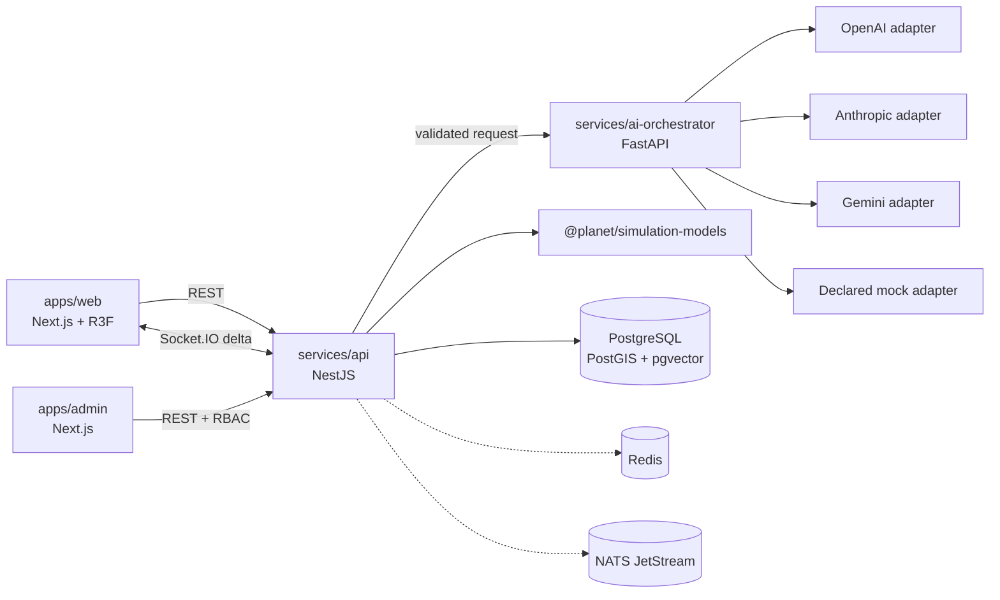
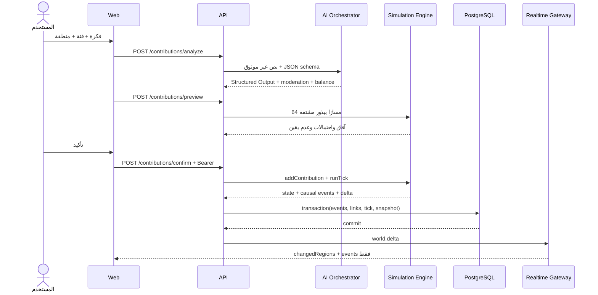
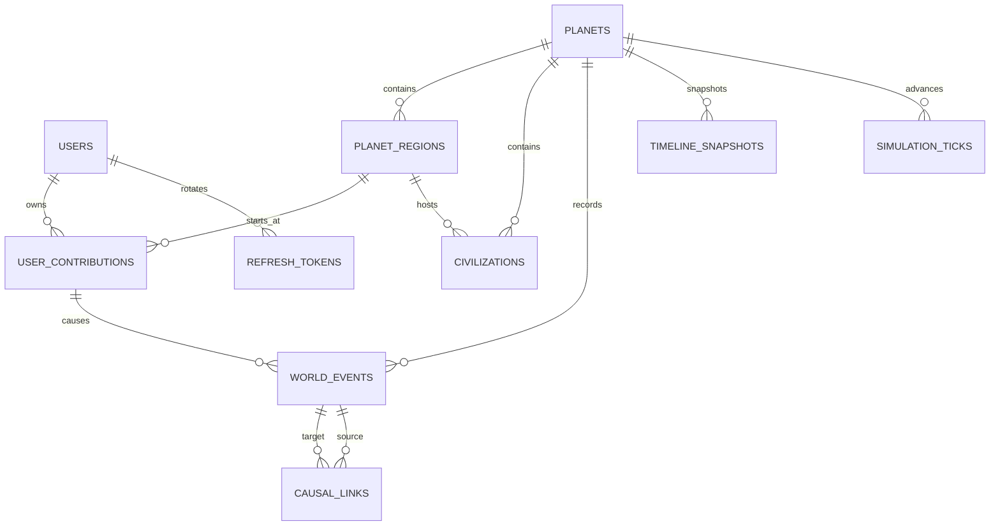

# معمارية «كوكب يولد أمامك»

## حدود المكونات

- `simulation-models` هو المصدر السلطوي للنتائج الرقمية. لا يستدعي نموذجًا لغويًا.
- `ai-orchestrator` يستخرج بنية صالحة ويوازنها، أو يصوغ سردًا من أحداث مسموحة.
- `api` يملك المعاملة: التحقق ← المعاينة ← المحاكاة ← الحفظ ← البث.
- `web` لا يحتوي منطق المحاكاة؛ يبني الشكل الهندسي من `PlanetRegion` ويطبق Delta فقط.
- Redis وNATS معرّفان في البنية ليُستخدما عند فصل العمال والبوابة، لكنهما غير موصولين بمسار المرحلة الحالية ولا يُعرضان كقدرة مفعلة.

## مسار المساهمة

لا يبث الخادم نجاحًا ولا Delta قبل اكتمال معاملة قاعدة البيانات.

## نموذج البيانات الأساسي

تحتفظ `timeline_snapshots.state` بالحالة القابلة للاستعادة، بينما يبقى `world_events` سجلًا مرتبًا لاستخراج السببية والتاريخ. يحمل كل Tick checksum مشتقًا من الحالة لتدقيق إعادة التشغيل.

## الأمان

- كلمات المرور: `scrypt` مع salt عشوائي.
- Access token قصير العمر؛ Refresh token عشوائي مخزن كـ SHA-256 وقابل للدوران.
- ValidationPipe يمنع الحقول غير المعروفة.
- CORS allowlist وHelmet CSP وThrottler مفعلون.
- WebSocket بلا token للقراءة فقط؛ token غير صالح يقطع الاتصال.
- أوامر Tick الإدارية محمية بـ RBAC.
- مدخل المستخدم لا يتحول إلى كود أو SQL أو system prompt.

## التوسع

تُفصل الخطوات التالية دون تغيير العقود الحالية:

1. نشر Ticks إلى NATS وتشغيل `simulation-engine` كعامل مستقل.
2. تخزين Hot deltas والأقفال الموزعة في Redis.
3. تقسيم المناطق إلى chunks مع texture/geometry streaming.
4. إضافة workers للإشعارات والذاكرة الدلالية.
5. نقل snapshots إلى تخزين كائني مع فهرس PostgreSQL عند تضخم الحالة.
