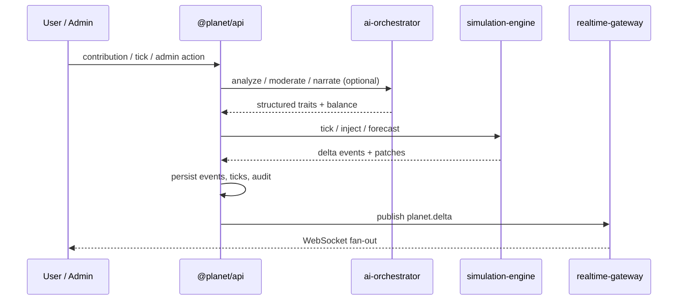

# System architecture

## Overview

**كوكب يولد أمامك** splits world truth, language intelligence, and presentation into three planes:

1. **Simulation** — sole authority for ticks, populations, climates, wars, and causal links.
2. **AI orchestrator** — interprets user text into structured traits, balances power, narrates from supplied facts.
3. **UI** — web (explorers) and admin (ops). Neither invents simulation state.

## Process topology

| Process | Port | Package / path |
|---------|------|----------------|
| Public web | 3000 | `apps/web` |
| Admin | 3001 | `apps/admin` |
| REST API | 4000 | `services/api` |
| Realtime WS | 4001 | `services/realtime-gateway` |
| Simulation | 8001 | `services/simulation-engine` |
| AI | 8002 | `services/ai-orchestrator` |

Shared libraries live under `packages/` (`shared-types`, `simulation-models`, `validation`, `config`, `analytics`).

## Event flow

1. **Genesis / seed** — planet row + regions, biomes, baseline species/civs written by `db:seed` or sim `rebuild`.
2. **User contribution** — API stores `user_contributions`, runs moderation, calls AI analyze, optionally injects into sim.
3. **Tick** — API (or admin) advances `currentTick`, calls sim (remote → TS models → local fallback), appends `world_events` + `simulation_ticks`.
4. **Realtime** — `publish({ type: 'planet.delta', ... })` mirrors to the gateway for subscribed clients.
5. **Rollback** — admin restores planet tick/year from `timeline_snapshots` and emits `planet.rollback`.

## Separation rules

| Concern | May do | Must not do |
|---------|--------|-------------|
| Sim | Mutate world state deterministically | Call LLMs or render UI |
| AI | Parse, score, narrate from facts | Invent species/events not in input facts |
| Web | Display API/WS state, submit contributions | Bypass balance / write raw sim tables |
| Admin | Pause ticks, roles, moderation, audit | Be linked from public marketing nav |

## Data stores

- **SQLite** (default local API via `SQLITE_PATH`) for rapid sandbox.
- **Postgres/PostGIS** schema under `services/api/migrations/postgres` for compose/prod.
- **Redis** — realtime / optional messaging.
- **MinIO** — object storage (wired in compose; upload routes may be incomplete).

## Fallbacks

`services/api/src/services/simulation-client.ts`:

1. Remote `SIM_ENGINE_URL`
2. `@planet/simulation-models` `SimulationTickEngine`
3. `local-sim` deterministic stub

AI client similarly falls back to mock when the orchestrator is down or keys are absent.

## Related docs

- [algorithms.md](./algorithms.md)
- [simulation-engine.md](./simulation-engine.md)
- [ai-integration.md](./ai-integration.md)
- [api.md](./api.md)
