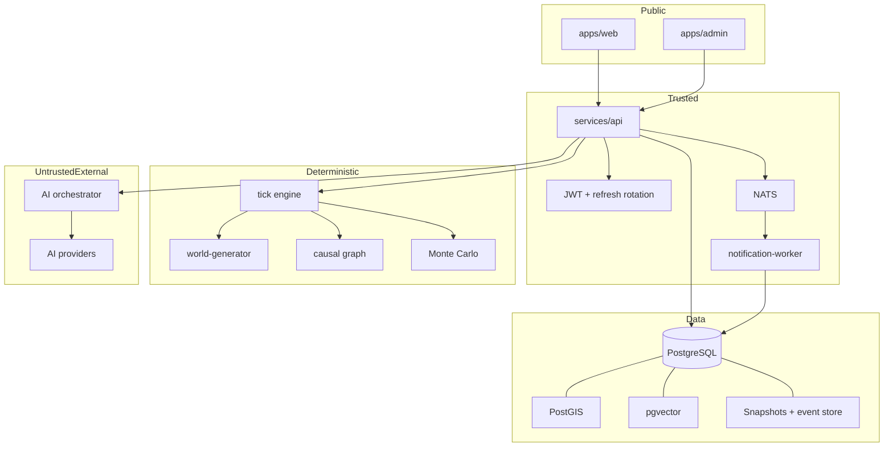

# المعمارية

## حدود الثقة

الواجهة عميل غير موثوق. لا تنشئ أحداث عالم ولا تحسب نتيجة مساهمة. ترسل النية و`expectedPlanetVersion` فقط. API هو حد التفويض، ومحرك المحاكاة حزمة نقية لا تستورد HTTP أو قاعدة البيانات أو أي موفر AI.

## قرارات مهمة

- **Event Sourcing:** كل تغير مهم يمر عبر `WorldEvent` ثم `applyEvent`. قيمة `sequence` هي ترتيب الحقيقة.
- **Optimistic concurrency:** المساهمة تحمل إصدار العالم الذي شاهده المستخدم. يرد API بـ409 إذا تغير العالم.
- **Determinism:** الوقت داخل الحدث مشتق من sequence وليس ساعة النظام، وPRNG مشتق من seed وtick.
- **AI isolation:** AI يحلل النص أو يسرد أحداثًا موجودة؛ لا يصل إلى مستودع العالم ولا يعيد state mutation.
- **Sandbox honesty:** Memory Store وSandbox Provider يعملان في التطوير فقط، وتظهر شارة SANDBOX في الواجهة.
- **Delta transport:** WebSocket يرسل الأحداث ومعرّفات المناطق المتغيرة، لا يرسل WorldState كاملًا.

## التوسع

حزمة المحاكاة عديمة الحالة ويمكن نقلها إلى worker مستقل يستهلك أوامر Tick من JetStream دون تغيير عقود الواجهة. وعند تعدد كواكب/مثيلات API، يجب نقل قفل الإصدار إلى `UPDATE ... WHERE version = expectedVersion` وإضافة stream لكل كوكب.

القدرات غير المكتملة لا تظهر كأزرار ناجحة: صفحات الإدارة الثانوية معروضة كتنقل غير نشط، بينما التحكم بالدورات والـRollback وحدهما موصولان فعليًا.
