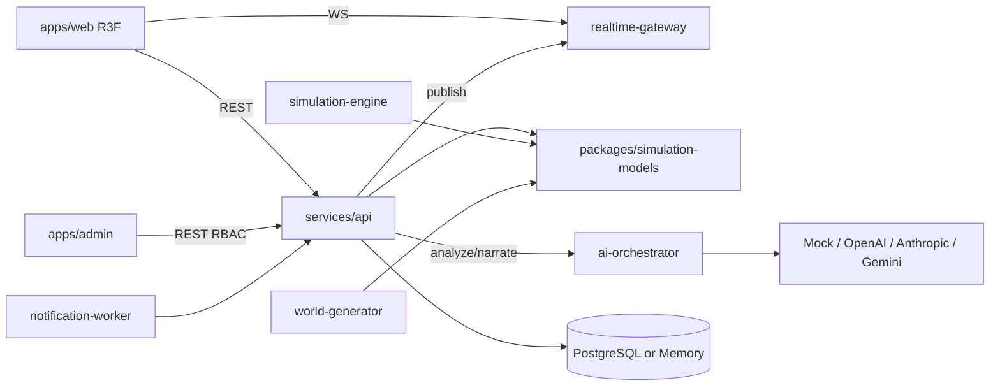

# Architecture Overview — كوكب يولد أمامك

## Principles

1. **Simulation owns truth** — ticks, ecology, climate, wars, economy.
2. **AI is a lens** — structured extraction, balance suggestions, grounded narrative.
3. **Determinism** — same seed + event sequence ⇒ same history.
4. **Event sourcing** — each change is a typed world event with cause links.
5. **Separation** — no simulation logic inside React; no LLM inventing facts.

## Runtime ports

| Service | Port |
|---|---|
| web | 3000 |
| admin | 3001 |
| api | 4000 |
| ai-orchestrator | 4100 |
| simulation-engine | 4200 |
| realtime-gateway | 4300 |
| world-generator | 4400 |
| notification-worker | 4500 |
