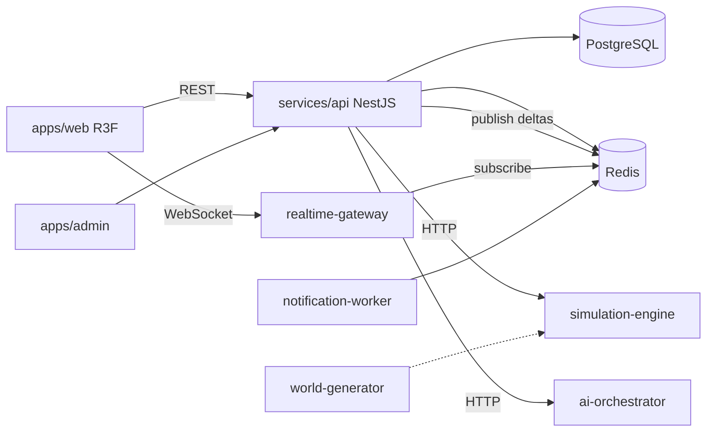

# Architecture Overview — كوكب يولد أمامك

## Separation of concerns

1. **World generation** — seeded procedural maps (height, moisture, temperature → biomes).
2. **Simulation engine** — deterministic ticks, event sourcing, causal graph, Monte Carlo foresight.
3. **AI orchestrator** — structured parse, balance, narration bounded by simulation facts.
4. **API** — auth, persistence, orchestration, OpenAPI; never invents sim results.
5. **Web** — visualization + UX; no simulation business logic in the browser beyond display.
6. **Realtime** — delta-only WebSocket fanout.

## Event sourcing

Every meaningful change becomes a `WorldEvent` with cause IDs, tick, region, confidence, and impact payload. Snapshots (`TimelineSnapshot`) enable rollback comparison.

## Security baseline

- JWT access + refresh rotation
- RBAC roles from guest → super_admin
- Rate limiting (Nest throttler)
- Input validation / moderation / prompt-injection checks
- Admin app isolated from public navigation
- Secrets via env; `.env.example` documented

## Data stores

| Store | Role |
|---|---|
| PostgreSQL | System of record (Prisma schema in `packages/db`) |
| PostGIS | Enabled when available for geo queries |
| pgvector | Optional semantic memory (image includes it; local may omit) |
| Redis | Cache, pub/sub deltas, worker queues |
| NATS JetStream | Optional event bus in Compose |
| S3/MinIO | Media/assets |
