# قاعدة البيانات — Database Schema

PostgreSQL عبر Prisma. المخطط الكامل في `services/api/prisma/schema.prisma` والترحيل في `prisma/migrations/0001_init`.

```mermaid
erDiagram
  User ||--|| Profile : has
  User ||--o{ Role : grants
  User ||--o{ RefreshToken : rotates
  User ||--o{ UserContribution : adds
  User ||--o{ Notification : receives
  User ||--o{ AuditLog : acts

  Planet ||--o{ PlanetRegion : cells
  Planet ||--o{ Biome : catalog
  Planet ||--o{ ClimateCell : samples
  Planet ||--o{ Species : fauna
  Planet ||--o{ Plant : flora
  Planet ||--o{ Civilization : peoples
  Planet ||--o{ City : cities
  Planet ||--o{ Technology : tree
  Planet ||--o{ Culture : cultures
  Planet ||--o{ Language : languages
  Planet ||--o{ TradeRoute : routes
  Planet ||--o{ Alliance : pacts
  Planet ||--o{ War : wars
  Planet ||--o{ Disease : plagues
  Planet ||--o{ Migration : flows
  Planet ||--o{ SimulationTick : clock
  Planet ||--o{ WorldEvent : history
  Planet ||--o{ CausalLink : causality
  Planet ||--o{ TimelineSnapshot : snapshots
  Planet ||--o{ UserContribution : contributions

  PlanetRegion ||--o{ Resource : deposits
  Civilization ||--o{ City : owns
  WorldEvent ||--o{ CausalLink : causes
  UserContribution ||--o{ ModerationResult : reviewed

  User {
    string id PK
    string email UK
    string passwordHash
    string displayName
    enum role
  }
  Planet {
    string id PK
    string seed UK
    enum status
    int tick
    int simYear
    json config
  }
  PlanetRegion {
    int index
    string biome
    float elevation
    float temperature
    float moisture
    float fertility
    float pollution
    float river
    string ownerCivKey
    int population
  }
  WorldEvent {
    string key UK
    int tick
    string type
    json actorIds
    string contributionId
    float magnitude
  }
  CausalLink {
    string causeEventId FK
    string effectEventId FK
  }
  UserContribution {
    string category
    text rawText
    json parsed
    enum status
    float impactScore
    int eventCount
  }
  TimelineSnapshot {
    int tick
    string hash
    json state
  }
  AIRequest {
    string provider
    string operation
    int tokensIn
    int tokensOut
    float costUsd
    bool sandbox
  }
```

## ملاحظات التصميم

- **المفاتيح الحتمية**: كيانات العالم (حضارات، أنواع، أحداث…) لها `key` = معرف المحرك الحتمي مع قيد `@@unique([planetId, key])` — الزرع والتزامن وإعادة التشغيل كلها idempotent.
- **التاريخ vs الحاضر**: الأحداث/النبضات/اللقطات/الروابط = سجل كامل؛ جداول الكيانات (حضارات، مدن، أنواع، نباتات) نماذج قراءة تُحدَّث دوريًا من المحرك.
- **PostGIS/pgvector**: الإحداثيات مخزنة أعمدة float لتبسيط التشغيل بدون امتدادات؛ صورة compose تستخدم postgis/postgis ويمكن ترقية الاستعلامات الجغرافية لاحقًا دون تغيير المخطط. البحث الدلالي (pgvector) موثق في roadmap كمرحلة لاحقة.
- **بيانات حساسة**: كلمات المرور bcrypt(12)، الرموز المنعشة مخزنة كهاش SHA-256 فقط.
