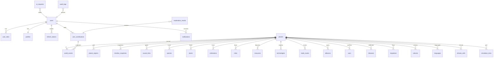

# Database — قاعدة البيانات

PostgreSQL 16+. Migration: `services/api/migrations/001_init.sql`
(runner: `pnpm --filter @planet/api migrate`). PostGIS/pgvector are prepared
but commented out — marked not activated for this phase.

## Event-sourced core

- `world_events` — append-only journal. Indexed by (planet, tick), type and
  origin user; `cause_ids` JSONB links form the causal graph with
  `causal_links`.
- `timeline_snapshots` — full engine state as JSONB every 25 ticks; rollback
  target + API rehydration.
- `simulation_ticks` — per-tick perf metrics (event counts, durations).

## Operational tables

`users`, `roles`, `user_roles`, `profiles`, `refresh_tokens` (rotation
families), `user_contributions` (raw text + structured + balance JSONB),
`notifications`, `moderation_results`, `ai_requests`, `audit_logs`.

## Simulation entity tables

`species`, `plants`, `civilizations`, `cities`, `resources`,
`technologies`, `cultures`, `languages`, `trade_routes`, `alliances`,
`wars`, `diseases`, `migrations`, `planet_regions`, `climate_cells`,
`biomes` — the denormalized browsing surface refreshed at snapshots. The
engine's live truth stays in the journal + snapshots; these tables serve
admin/browse queries without unpacking JSONB.

## Seed

`pnpm seed` generates the demo planet *through the engine itself* (12
civilizations, 300 species, 800 plants, 50 technologies, ~140 deposits, 400
ticks ≈ 2000 years of replayable history) and writes events + snapshots.
