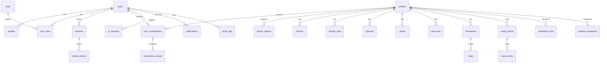

# Database

Default local store: **SQLite** (`SQLITE_PATH`, drizzle schema in `services/api/src/db/schema.ts`).  
Compose/prod: **Postgres/PostGIS** init SQL in `services/api/migrations/postgres/001_init.sql`.

## ER overview



## Entity notes

| Table | Purpose |
|-------|---------|
| `users` / `profiles` | Identity, locale, preferences |
| `roles` / `user_roles` | RBAC (`visitor` … `super_admin`) |
| `sessions` / `refresh_tokens` | Auth sessions |
| `planets` | Seed, tick, age, status, resolution |
| `planet_regions` | Grid cells with elev/moisture/temp |
| `biomes` | Per-planet biome definitions |
| `climate_cells` | Climate field samples by tick |
| `species` / `plants` / `resources` | Biosphere & materials |
| `civilizations` / `cities` / `technologies` / `cultures` / `languages` | Society layer |
| `trade_routes` / `alliances` / `wars` | Geopolitics & economy links |
| `diseases` / `migrations` | Pressures & movement |
| `user_contributions` | Pending → analyzing → balanced → injected / rejected |
| `simulation_ticks` | Tick ledger |
| `world_events` / `causal_links` | Event sourcing |
| `timeline_snapshots` | Rollback points |
| `ai_requests` | Provider logs / latency |
| `moderation_results` | Approve / reject / flag |
| `notifications` | User inbox |
| `audit_logs` | Privileged action trail |

## Migrations & seed

```bash
pnpm db:migrate
pnpm db:seed
```

Seed creates Super Admin, demo explorer, genesis planet `genesis-alpha-2026`, baseline content. Re-running skips if the genesis seed exists.
