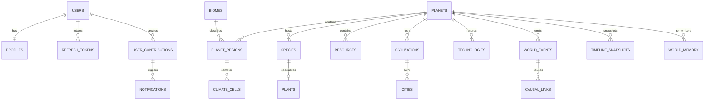

# قاعدة البيانات

PostgreSQL هو مصدر الحقيقة في الإنتاج. PostGIS يخزن مراكز وحدود المناطق والمدن والمسارات، وpgvector مخصص لذاكرة العالم الدلالية. إسقاط `planets.state` يسرّع القراءة، بينما `world_events` هو التاريخ المرتب.

## الاتساق

- `(planet_id, sequence)` فريد ويرتب event stream.
- `(planet_id, tick)` فريد للـSnapshot والدورة.
- مساهمات المستخدم تحمل `world_version`.
- Refresh tokens لا تحفظ بصورتها الأصلية؛ يحفظ SHA-256 وتدوّر عند كل استعمال.
- المواقع تستخدم `geography(..., 4326)` مع GiST indexes.
- ذاكرة العالم تستخدم HNSW cosine index.

## بيانات Seed

`pnpm db:seed` حتمي بالنسبة إلى `WORLD_SEED` للكيانات العالمية، وينشئ:

| الكيان | العدد |
|---|---:|
| الحضارات | 12 |
| المدن | 40 |
| الموارد | 120 |
| المخلوقات | 300 |
| النباتات | 800 |
| التقنيات | 50 |
| المناطق | 240 |

كلمة مرور حساب Sandbox تُهشّم بـscrypt وبملح جديد. تشغيل seed مرة أخرى idempotent للكيانات ذات المعرفات الحتمية.

## النسخ الاحتياطي

في الإنتاج:

1. فعّل PostgreSQL PITR وWAL archive إلى تخزين منفصل.
2. خذ base backup دوريًا واختبر الاستعادة.
3. احتفظ بـJetStream replicas=3.
4. ضع assets في bucket versioned.
5. قِس RPO/RTO باختبار disaster recovery، لا بوجود ملفات الإعداد فقط.
