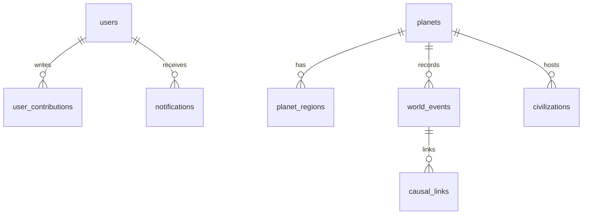

# Database

PostgreSQL 16 via Drizzle schema in `services/api/src/db/schema.ts`.

## Core tables

User, Session, Planet, PlanetRegion, Civilization, City, Species, Plant, Resource, Technology, WorldEvent, CausalLink, UserContribution, SimulationTick, TimelineSnapshot, AIRequest, ModerationResult, Notification, AuditLog, War, TradeRoute, AnalysisCache.

## Migrations

```bash
pnpm db:migrate   # applies SQL bootstrap
pnpm db:seed      # sandbox users + ensures world
pnpm db:reset     # drop all (dev only)
```

## Seed world

Default seed `planet-born-alpha-2026`:

- 12 civilizations · ~36 cities · 120 resources · 300 species · 800 plants · 50 technologies
- Bootstrap timeline eras (oceans → life → civilizations → present)

## ER (simplified)


