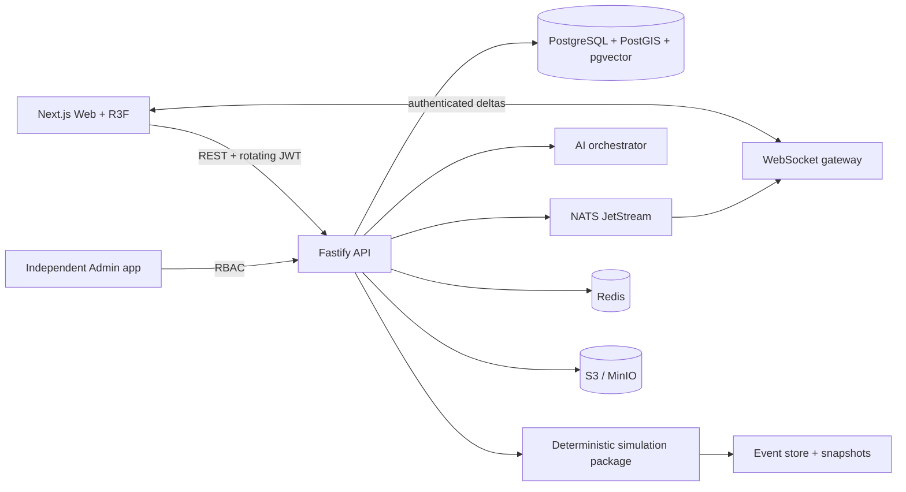

# Architecture / المعمارية

## Runtime topology

The first production slice deploys REST, WebSocket delivery, and the simulation
command handler in one API process. Their boundaries are separate modules and
NATS subjects; extracting them into independently scaled services does not move
simulation logic into either UI. Redis and MinIO are provisioned but their
application adapters are intentionally marked as the next phase.

## Source map

- `apps/web`: real-time Arabic/English world dashboard and WebGL planet.
- `apps/admin`: separate RBAC-protected operations dashboard.
- `services/api`: authentication, OpenAPI, persistence, WebSocket deltas, NATS.
- `services/ai-orchestrator`: provider-neutral structured analysis and guarded
  deterministic sandbox.
- `packages/simulation-models`: seeded generation, tick engine, causal events,
  replay, and Monte Carlo forecast.
- `packages/shared-types`: cross-service schemas and versioned contracts.
- `services/api/migrations`: PostgreSQL/PostGIS/pgvector schema and seed roles.

## Data invariants

1. A mutation locks the planet row under a serializable transaction.
2. The caller supplies `expectedVersion`; stale contributions fail with `409`.
3. Every accepted mutation appends immutable events and a state snapshot.
4. Every event has a non-empty cause; secondary events get causal links.
5. World state is generated only from the configured seed and tick number.
6. WebSocket traffic contains deltas, never a replacement full world.
7. AI output is schema-validated and cannot directly mutate the world.

## Database

The migration contains the complete domain tables requested for users, roles,
regions, biomes, climate, species, plants, resources, civilizations, cities,
technologies, cultures, languages, trade routes, alliances, wars, diseases,
migrations, contributions, ticks, events, causal links, snapshots, AI calls,
moderation, notifications, audit logs, and vector-backed world memory.

PostGIS geography columns store regions and routes. `world_memory.embedding`
uses pgvector; deterministic numeric state remains in normalized tables and
JSONB snapshots.

## Threat model controls in this slice

- Argon-equivalent work factor via bcrypt cost 12; short passwords are rejected.
- 15-minute access JWTs with issuer/audience checks.
- Opaque refresh tokens are hashed in PostgreSQL and rotated by family.
- Refresh reuse revokes the whole family.
- Strict CORS, SameSite cookies, CSP, Helmet, body limits, and rate limits.
- Zod validation at every write boundary.
- SQL parameters only; user text is never code, SQL, or an internal prompt.
- Prompt-injection signatures are rejected before any provider call.
- Secrets are environment-only and logs redact authorization/cookies/passwords.

Production still needs managed secret storage, TLS termination, upload malware
scanning, backup verification, and provider-specific moderation before public
launch.
