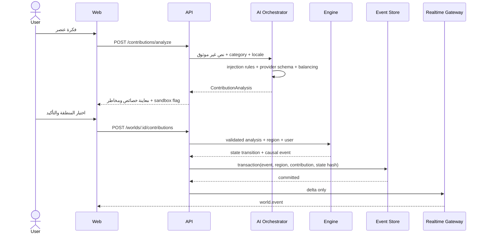
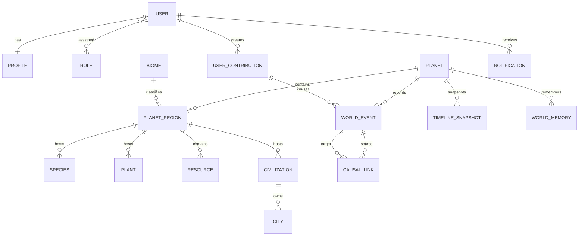

# معمارية ومحرك «كوكب يولد أمامك»

## مبدأ السلطة

هناك ثلاثة حدود لا يجوز تجاوزها:

1. الواجهة تعرض الحالة ولا تحسب التاريخ.
2. الذكاء الاصطناعي يحول اللغة إلى عقد منظم، ولا يكتب أحداث العالم.
3. محرك المحاكاة وحده ينتج `directImpact` ويغير `WorldState`.

## دورة الكتابة



لا يرسل API نجاحًا أو WebSocket delta قبل نجاح معاملة التخزين. وضع
`memory-sandbox` استثناء محلي ظاهر، ومحظور عند `APP_ENV=production`.

## التوليد الإجرائي

`generateWorld(seed)` يستخدم:

- توزيع Fibonacci sphere للخلايا المتقاربة المساحة.
- Fractal value noise للقارات والرطوبة والحرارة والموارد.
- Ridge noise لتقريب سلاسل الجبال وحدود الصفائح.
- خط العرض، الارتفاع، تأثير المحيط، وظل المطر لحساب المناخ.
- مصنفًا حتميًا للأقاليم: ocean, coast, plains, rainforest,
  temperate_forest, desert, mountain, tundra, wetland, steppe, volcanic, ice.

معرفات العالم والمناطق والكيانات مشتقة من Seed عبر UUIDv5-like deterministic
hash. لا تستخدم `Math.random` أو الوقت الحقيقي في التوليد.

## الزمن وإعادة التشغيل

مولد الأرقام `SeededRandom` هو xoshiro-family state machine. ينشئ كل Tick
مولدًا من:

```text
world.seed + ":tick:" + nextTick
```

وينتهي بحدث `SIMULATION_TICK_COMPLETED`. لذلك لا يعتمد Replay على وجود حدث
مناخي في نهاية الفترة. يحتوي كل `WorldEvent` على:

- sequence متزايد بلا فجوات.
- tick وyear.
- cause لا يمكن أن يكون فارغًا.
- causeEventIds وactorIds.
- regionId وcontributionId عند وجودهما.
- payload وdirectImpact وconfidence.
- occurredAt مشتق حتميًا من sequence، لا من ساعة الخادم.

تطبق `replayWorld` الأحداث حسب sequence وترفض أي فجوة. تحسب `hashWorld`
serialization مرتبة المفاتيح للحالة المؤثرة. تحفظ Snapshot نسخة الحالة وhash؛
يرفض `restoreSnapshot` أي تعديل في المحتوى.

## نموذج التأثير الحالي

المقطع الأول ينفذ تأثير النبات فعليًا:

1. يحسب ملاءمة الموطن من الماء والحرارة والتكيف.
2. يطبق تغير الخصوبة وامتصاص التلوث ضمن حدود `[0,1]`.
3. يستخدم احتمالًا seeded لانتشار البذور.
4. يختار أقرب منطقة متوافقة بالمسافة الزاوية.
5. ينشئ `PLANT_SPREAD` أو `POLLUTION_CHANGED`.
6. يربط الحدث بأحدث حدث سابق للمساهمة داخل causal graph.

نماذج الاقتصاد والحرب والأمراض العميقة موجودة في مخطط البيانات، لكنها ليست
منفذة في محرك المرحلة الأولى ولا تعرض الواجهة رسومًا لها.

## مخطط البيانات المختصر



`world_memory.embedding` هو vector(1536). حقول الخلية الجغرافية جاهزة للترقية
إلى PostGIS geometry؛ النسخة الحالية تحفظ latitude/longitude وJSON cell حتى
تستقر tessellation النهائية.

## التوسع المخطط

- استخراج `WorldService` إلى worker مستقل متصل بـNATS JetStream.
- تحويل WebSocket داخل API إلى realtime-gateway أفقي يعتمد Redis adapter.
- حفظ Snapshot مضغوط في S3 كل N ticks.
- إضافة Monte Carlo branches كنسخ state مع scenario seed مستقل.
- تطبيق ECS systems منفصلة للمناخ، الغذاء، السكان، الاقتصاد والدبلوماسية.
- إضافة OpenTelemetry spans حول AI، المعاملة، tick، والبث.
