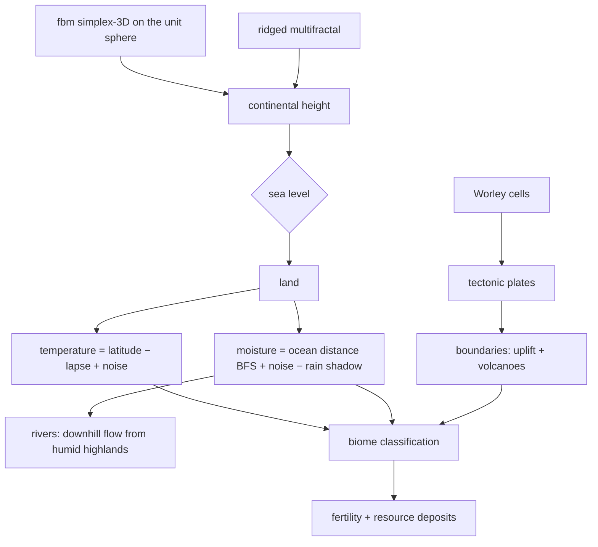

# Simulation Engine — محرك المحاكاة

`@planet/simulation-models` — the canonical deterministic world engine.

## Determinism contract

- All randomness flows through forkable seeded streams (xmur3 hash +
  mulberry32). `Math.random`, wall-clock time and unseeded entropy are never
  used inside the engine.
- Per tick, one root stream `hash(seed:tick:N)` forks per system
  (`climate`, `ecosystem`, `civilization`, `conflict`, `economy`), so systems
  consume independent, reproducible sequences.
- Tests: same seed → identical state fingerprint **and** identical journal
  hash after hundreds of ticks; rollback+replay reproduces both exactly;
  Python's mulberry32 port is bit-identical (`1e-15` tolerance).

## World generation (seeded, reproducible)

Key choices: sampling 3D noise on the sphere avoids UV seams and polar
pinch; the rain-shadow walk samples upwind cells along the prevailing wind
band (trade winds / westerlies / polar easterlies); rivers carve by greedy
downhill walks and boost moisture/fertility.

## Tick loop

Each tick advances `YEARS_PER_TICK` years (default 5). Systems run in a
fixed order, each reading and mutating `WorldState` and appending events
with explicit `causeIds`:

1. **climate** — per-cell relaxation toward latitude+forcing equilibrium,
   neighbor smoothing (cellular automaton), greenhouse forcing from
   pollution, volcanic aerosol cooling, vegetation feedback. Emits
   `CLIMATE_CHANGED`, `DROUGHT_STARTED`, `WILDFIRE_STARTED`,
   `FLOOD_OCCURRED`, `VOLCANO_ERUPTED`; applies desertification and ice
   melt as biome drift.
2. **ecosystem** — plant logistic growth/spread by habitat suitability;
   species logistic growth bounded by carrying capacity, Lotka–Volterra-style
   predation transfer on shared habitat, starvation, BFS-gated migration
   (terrestrial species can never cross oceans — invariant-tested), mutation
   into subspecies, extinction below the viability floor with food-web
   cascade.
3. **civilization** — food production vs consumption (population capped by
   regional carrying capacity), tech-gated resource extraction, research
   accumulation → discoveries, health/stability dynamics, disease outbreaks
   and containment. One major action per civ per tick chosen by **Utility
   AI**: scores for expand / found city / trade / ally / war / conserve /
   migrate / reform, computed from pressure, geography, power ratios,
   resource competition and *remembered grievances*.
4. **conflict** — validates war intents (no wars on allies, no duplicate
   wars) and resolves battles: force comparison weighted by tech, terrain
   defense, morale and alliances; casualties, border flips, city sacks,
   displacement migrations, war-score termination with reparations and
   long-term memory (losers remember — fueling future wars). Post-war
   containment alliances can emerge.
5. **economy** — A* trade routes between complementary economies (terrain
   cost + war-risk surcharge), income and relation drift per active route,
   routes as disease vectors.

## Event sourcing, snapshots, rollback

- Every mutation is described by a `WorldEvent` (id, tick, year, type, cell,
  causeIds, cause, actors, data, confidence, importance, origin attribution).
- Snapshots every 25 ticks (state is plain JSON; `structuredClone`).
- **Rollback** restores the nearest snapshot and replays forward. User
  placements made after the snapshot are re-applied at their original ticks
  in order — otherwise replay would diverge from the world users remember.
  The store is re-synced: events from the snapshot point are replaced by the
  deterministically replayed journal (identical ids).
- `originUserId` propagates downstream automatically at emission time, so a
  user's full causal blast radius is queryable.

## Contributions & balance

`validateBalance` computes a power score from trait weights against a
per-category budget, checks forbidden combos (unkillable plague, immortal
swarm, infinite-energy loop) and trait saturation. Violations produce a
**balanced suggestion** (uniform scale + combo breaking) instead of a blunt
rejection. Placement turns the contribution into a real entity at the chosen
cell; the ordinary systems do the rest.

## Monte Carlo scenarios

`runScenarios` forks N branch worlds from the current snapshot, perturbing
only the future random stream, runs the horizon, scores each branch
(contribution viability 0.4 + world stability 0.3 + impact 0.3) and reports
best/worst/most-likely + uncertainty (score variance + event-signature
divergence) + decisive factors (event types separating top/bottom
quartiles). Never a single-certain prediction.

## Causal graph & narration allowlist

`contributionDescendants` walks the journal forward from a contribution;
`causalAncestors` walks backward from any event; `narrationAllowlist`
produces the exact set of facts the AI narrator may mention — the hard guard
against invented history.

## Performance notes

Grid default 48×96 = 4608 cells; a tick costs single-digit milliseconds;
400-tick demo history completes in seconds. Snapshots/deltas avoid full
state broadcasts; the web client regenerates terrain locally from the seed
in a Web Worker.
